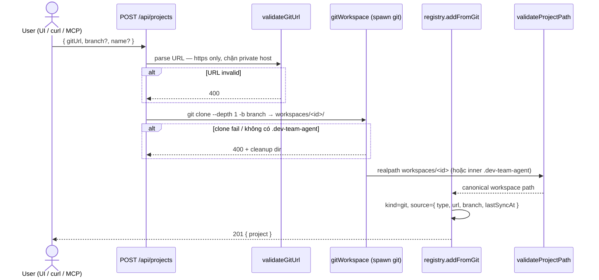

# Investigate — U0003-2

## 1. Tổng quan

Task **U0003-2** (subtask của epic #39 / issue #41 — `[F0003.2] Git workspace onboarding trên server`) thêm khả năng đăng ký project trên dashboard bằng **Git HTTPS URL**: server shallow-clone repo vào `$DEV_TEAM_DASHBOARD_HOME/workspaces/<id>/`, validate tồn tại `.dev-team-agent/`, lưu registry với `kind: 'git'`, và cung cấp sync (`git pull` / re-clone khi fail) qua REST, CLI và UI.

**Phụ thuộc:** #40 (U0003, PR #45) — server-ready runtime (auth token, health, Docker). Implement #41 nên base trên `feat/U0003/main` sau khi merge #45.

**IN scope (theo issue #41):**

1. Mở rộng `Project`: `kind: 'git'`, `source: { type, url, branch, lastSyncAt? }`
2. `POST /api/projects` nhận `{ gitUrl, branch?, name? }` → shallow clone → resolve `.dev-team-agent` path
3. `POST /api/projects/:id/sync` — `git pull` hoặc re-clone nếu fail
4. CLI `bun run workspace:sync [--project=id]`
5. UI `ProjectBar`: tab "Git URL" + nút Sync
6. MCP `add_project` optional `gitUrl` (hoặc doc dùng REST)

**OUT scope:**

- Epic #39 tổng thể (chỉ #41)
- #40 auth/health/Docker (đã xong trên branch parent; không implement lại)
- Git SSH URL, credential store cho private repo (issue chỉ yêu cầu validate HTTPS tương tự `fetchUrlSafe`)
- Xóa thư mục clone khi `remove` project (giữ hành vi hiện tại: chỉ gỡ registry)
- Orchestrator chạy trong clone — dashboard chỉ đọc/ghi artifact như local project

**Trạng thái hiện tại (survey branch workspace):**

| Thành phần | Trạng thái | Evidence |
|---|---|---|
| `Project.kind` | Luôn `'local'` khi `add()` | `server/registry.ts:232` |
| `Project.source` | Không có field | `server/registry.ts:21-28` |
| `POST /api/projects` | Chỉ `{ path, name? }` | `server/http/routes/registry.ts:27` |
| Sync endpoint | Không tồn tại | grep `sync` trong `server/http/` = 0 |
| `workspace:sync` script | Không có | `package.json:7-18` |
| `ProjectBar` | Form path-only | `src/features/monitor/components/ProjectBar.vue:100-118` |
| MCP `add_project` | Chỉ `path` | `mcp/server.ts:76-84` |
| Git clone helper | Không tồn tại | grep `git clone` = 0 |
| `fetchUrlSafe` / `isPrivateHostname` | Có sẵn — tái sử dụng cho validate URL | `server/agents/fetch.ts:7-15`, `shared/sanitize.ts:47-52` |
| `child_process.spawn` pattern | Có trong runners | `server/runners/providers/claude-code-cli.ts:1,59` |

**Ghi chú branch:** Workspace survey **chưa** có artifact #40 (`DEV_TEAM_API_TOKEN`, `/api/health`, `Dockerfile` — grep = 0). Khi triển khai #41 trên `feat/U0003/main`, các endpoint git mới sẽ đi qua auth middleware #40 khi token được set.

## 2. Entry points

| Màn hình / Chức năng | UI trigger | Transport | Handler | File / evidence |
|---|---|---|---|---|
| Thêm project (local path) | ProjectBar → ＋ → nhập path | `POST /api/projects` | `registry.add({ path })` | `ProjectBar.vue:35-51`, `registry.ts:218-239` |
| Thêm project (Git URL) — **mới** | ProjectBar tab "Git URL" → Thêm | `POST /api/projects` `{ gitUrl, branch?, name? }` | `addFromGit` (dự kiến) → clone → `validateProjectPath` | `registry.ts` (mở rộng), `registry.ts` route |
| Sync git workspace — **mới** | ProjectBar nút Sync (git projects) | `POST /api/projects/:id/sync` | `syncGitProject(id)` | `registry.ts` route (mới) |
| Sync CLI — **mới** | `bun run workspace:sync [--project=id]` | Script gọi logic sync | `scripts/workspace-sync.ts` (mới) | `package.json` (mới) |
| Monitor tasks sau onboard | Chọn project → poll | `GET /api/tasks?project=` | `registerTaskRoutes` | `src/App.vue:34-35`, `useTaskPolling` |
| MCP add git — **mới** | Claude Code `add_project` | MCP stdio | `handleAddProject` | `mcp/server.ts:44-48` |
| Registry list/get | Sidebar project list | `GET /api/projects` | `registry.list()` | `server/http/routes/registry.ts:8-16` |

## 3. Flow xử lý

### 3.1 Onboard project bằng Git URL



### 3.2 Sync git workspace

```mermaid
flowchart TD
  A[POST /api/projects/:id/sync] --> B{project.kind === git?}
  B -->|no| C[400 not a git project]
  B -->|yes| D[cd clone root]
  D --> E[git pull origin branch]
  E -->|ok| F[validateProjectPath + cập nhật lastSyncAt]
  E -->|fail| G[rm workspace dir + shallow re-clone]
  G --> H{re-clone ok?}
  H -->|yes| F
  H -->|no| I[500/400 error]
  F --> J[200 { project, syncedAt }]
```

### 3.3 Luồng Monitor sau onboard (không đổi)

1. `POST /api/projects` trả `project.id`
2. UI `emit('select', project.id)` — `ProjectBar.vue:46`
3. `useTaskPolling` poll `GET /api/tasks?project=<id>` — `src/App.vue:34-35`
4. `resolveProjectRoot(id)` → `project.path` (canonical `.dev-team-agent`) — `registry.ts:286-288`

## 4. Phạm vi ảnh hưởng

### 4.1 DB / schema

| Table | Column | Trạng thái | Evidence |
|---|---|---|---|
| — | — | Không áp dụng | Registry JSON `projects.json`; clone on disk dưới `registryHome()/workspaces/` |

**Schema registry mở rộng (trong `projects.json`):**

```typescript
// server/registry.ts — mở rộng interface Project
kind: 'local' | 'git'
source?: { type: 'git'; url: string; branch: string; lastSyncAt?: string }
// path: vẫn là canonical .dev-team-agent (giữ resolveProjectRoot không đổi)
```

Backward compat: entry cũ thiếu `kind` → treat as `'local'` khi đọc (optional migration trong `loadRegistry`).

### 4.2 Files cần sửa

**Backend — registry & git workspace**

| File | Method / vị trí | Thay đổi dự kiến | Confidence |
|---|---|---|---|
| `server/registry.ts` | `Project` interface L21-28 | Thêm `kind`, `source?`; normalize legacy entries | High |
| `server/registry.ts` | `add()` L218-239 | Tách hoặc branch: path → `kind:local` (giữ nguyên); git → delegate `addFromGit` | High |
| `server/git/workspace.ts` **(mới)** | `validateGitUrl`, `cloneShallow`, `pullOrReclone`, `workspaceDir(id)` | Validate HTTPS + `isPrivateHostname`; `spawn('git', ...)`; dir `registryHome()/workspaces/<id>` | High |
| `server/registry.ts` | `syncGitProject(id)` **(mới)** | Load project, gọi workspace helper, cập nhật `lastSyncAt`, atomic `saveRegistry` | High |
| `shared/git/url.ts` **(mới, hoặc trong workspace.ts)** | `validateGitUrl` | Zod hoặc pure fn: https-only, hostname guard (mirror `fetchUrlSafe` L14-15) | High |

**Backend — HTTP routes**

| File | Method / vị trí | Thay đổi dự kiến | Confidence |
|---|---|---|---|
| `server/http/routes/registry.ts` | `POST /api/projects` L19-30 | Nhận `gitUrl` XOR `path`; gọi `add` / `addFromGit` | High |
| `server/http/routes/registry.ts` | `POST /api/projects/:id/sync` **(mới)** | Sync git project; 404 unknown id; 400 non-git | High |
| `server/http/routes/registry.ts` | `registerRegistryRoutes` | Đăng ký route `:id` trước catch-all `app.all` | Medium |

**CLI**

| File | Thay đổi dự kiến | Confidence |
|---|---|---|
| `scripts/workspace-sync.ts` **(mới)** | Parse `--project=`; gọi `syncGitProject` hoặc sync all git projects | High |
| `package.json` | `"workspace:sync": "bun scripts/workspace-sync.ts"` | High |

**Frontend**

| File | Method / vị trí | Thay đổi dự kiến | Confidence |
|---|---|---|---|
| `src/api/client.ts` | `addProject` L28-36 | Overload/param `gitUrl`, `branch`; hoặc `addGitProject()` riêng | High |
| `src/api/client.ts` | `syncProject(id)` **(mới)** | `POST /api/projects/${id}/sync` | High |
| `src/features/monitor/components/ProjectBar.vue` | form L17-118 | Tab Local / Git URL; hiển thị nút Sync khi `p.kind === 'git'` | High |

**MCP**

| File | Method / vị trí | Thay đổi dự kiến | Confidence |
|---|---|---|---|
| `mcp/server.ts` | `handleAddProject` L44-48 | Nhận optional `gitUrl`, `branch`; delegate registry | High |
| `mcp/server.ts` | tool schema L76-84 | Zod: `path` optional nếu có `gitUrl` (exactly one required) | Medium |

**Docs (ngoài MVP code nhưng liên quan deploy)**

| File | Thay đổi dự kiến | Confidence |
|---|---|---|
| `docs/deploy.md` (từ #40) | Ghi chú `workspaces/` dưới `DEV_TEAM_DASHBOARD_HOME`, yêu cầu `git` trong PATH (Docker) | Medium |

**Tests**

| File | Thay đổi dự kiến | Confidence |
|---|---|---|
| `tests/server/registry.test.ts` | `addFromGit` mock spawn; legacy `kind:local`; idempotent URL | High |
| `tests/server/git/workspace.test.ts` **(mới)** | `validateGitUrl` rejects http/private; clone args | High |
| `tests/server/http/api.golden.test.ts` | POST gitUrl (mocked git); sync 404/400; local POST regression | High |
| `tests/mcp/server.test.ts` | `add_project` với `gitUrl` (mocked) | Medium |
| `tests/src/features/monitor/ProjectBar.test.ts` **(mới, tuỳ chọn)** | Vitest: tab switch, gọi API đúng payload | Low |

### 4.3 Blast radius

- **`resolveProjectRoot` không đổi contract:** Vẫn trả `project.path` (canonical `.dev-team-agent`). Mọi route task/artifact/catalog tiếp tục hoạt động sau onboard git — **blast radius thấp** cho domain API hiện có.
- **Registry JSON:** Thêm field optional — reader cũ (nếu rollback) bỏ qua `source`; writer mới phải normalize `kind` khi load.
- **Disk usage:** Clone nằm trong `DEV_TEAM_DASHBOARD_HOME` — Docker chỉ cần volume `dashboard-home` (khác pattern `./workspaces:/workspaces:ro` trong design #40 — #41 gom vào home).
- **Git binary:** Server container phải có `git` trong PATH — cần bổ sung `RUN apt-get install git` (hoặc tương đương) trong `Dockerfile` #40 khi triển khai chung.
- **Auth #40:** `POST /api/projects` và sync là mutating — khi `DEV_TEAM_API_TOKEN` set, cần token (không public). Không ảnh hưởng `GET /api/tasks` read path.
- **CI:** Test git **phải mock** `spawn` — không gọi network thật trong `bun test` / Playwright (theo knowhow `docs/knowhow/ci-cd-testing.md`).
- **`remove` project:** Không xóa `workspaces/<id>/` — orphan disk có thể tích lũy; document hoặc defer cleanup job (ngoài scope #41).
- **Concurrent sync:** Hai request sync cùng project — cần lock đơn giản (file lock hoặc in-process mutex) để tránh corrupt clone; **Medium risk** nếu không xử lý.
- **MCP vs REST:** MCP gọi cùng `registry` module — không bypass validation (giữ single source of truth `server/registry.ts`).

## 5. Test coverage hiện tại

| Khu vực | Coverage | Ghi chú |
|---|---|---|
| Registry CRUD local | `tests/server/registry.test.ts` | `add`, `validateProjectPath`, `resolveProjectRoot` — không có git |
| Project HTTP | `tests/server/http/api.golden.test.ts` L227-238 | Chỉ GET empty + PUT 405; không test POST |
| MCP add path | `tests/mcp/server.test.ts` L51-70 | Flow path-only |
| `fetchUrlSafe` guards | `tests/server/agents/fetch.test.ts` | Pattern tái sử dụng cho `validateGitUrl` |
| `ProjectBar` UI | Không có vitest | Chỉ e2e gián tiếp qua monitor |
| E2E project CRUD | Không có spec riêng | `playwright.config.ts` dùng fixture `.dev-team-agent` cố định |
| Git workspace | 0 | Toàn bộ surface mới |

**Test đề xuất P0 (theo acceptance criteria #41):**

1. `validateGitUrl('http://...')` → reject; `https://127.0.0.1/...` → reject (private)
2. `POST /api/projects` `{ gitUrl, branch }` (mock git) → 201, `kind: 'git'`, `path` trỏ `.dev-team-agent` trong clone
3. Sau add → `GET /api/tasks?project=<id>` → 200 có tasks (fixture repo local trong test tmp)
4. `POST /api/projects/:id/sync` (mock pull thành công) → `lastSyncAt` cập nhật
5. Sync khi pull fail → re-clone (mock)
6. `POST /api/projects` `{ path }` → vẫn `kind: 'local'` (backward compat)
7. `POST /api/projects/:id/sync` với local project → 400
8. MCP `add_project { gitUrl }` (mock) → cùng kết quả REST

**Test P1:** E2E thật với repo public nhỏ (hoặc local `git daemon` fixture) — có thể hoãn; CI dùng mock.

## 6. Rủi ro và điểm cần xác nhận

| Rủi ro | Confidence | Ghi chú |
|---|---|---|
| Private GitHub repo không clone được (không credential) | High | Issue chỉ HTTPS validate — public repo là MVP; private cần token phase sau |
| Thiếu `git` trong Docker image | High | #40 Dockerfile cần cài `git` khi ship #41 |
| Race sync đồng thời | Medium | Cần lock per project id |
| Shallow clone thiếu branch / default branch sai | Medium | Default `branch` → `'main'` hoặc detect sau clone; document |
| Re-clone xóa local edits trong workspace dir | Medium | Chỉ ảnh hưởng clone server-side — đúng thiết kế read-only mirror |
| Idempotent add cùng `gitUrl` | Medium | Nên trả existing project (mirror idempotent `path` L225-227) |
| Route style `?id=` vs `/:id/sync` | Low | Issue ghi `/:id/sync`; codebase đã dùng `:id` cho jobs (`runners.ts:111`) — nhất quán Hono |
| Disk orphan sau remove | Low | Chấp nhận MVP; ghi trong deploy doc |

## 7. Câu hỏi chưa rõ

| # | Câu hỏi | Blocking? |
|---|---|---|
| 1 | Private repo: có cần hỗ trợ `GIT_TOKEN` env / credential profile trong MVP không? | Không — issue không yêu cầu; acceptance dùng public HTTPS |
| 2 | Branch mặc định khi `branch` omitted: `'main'`, `'master'`, hay để git default? | Không — designer chọn `'main'` + fallback message nếu fail |
| 3 | MCP: implement `gitUrl` trong tool hay chỉ document "dùng REST"? | Không — issue ghi "optional gitUrl (hoặc doc REST)"; implement cả hai nếu effort thấp |
| 4 | `POST /api/projects` có cho phép gửi đồng thời `path` + `gitUrl` không? | Không — reject 400 mutual exclusive |
| 5 | Docker: clone vào `DEV_TEAM_DASHBOARD_HOME/workspaces/` hay volume `./workspaces` riêng như design #40? | Không — issue #41 chốt under `DEV_TEAM_DASHBOARD_HOME`; cập nhật `deploy.md` cho khớp |

Không có câu hỏi blocking — **không tạo `qa.md`**.
