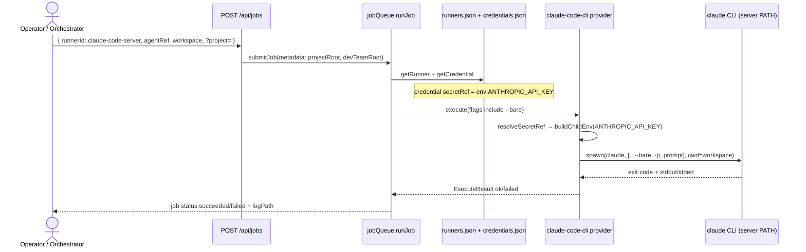
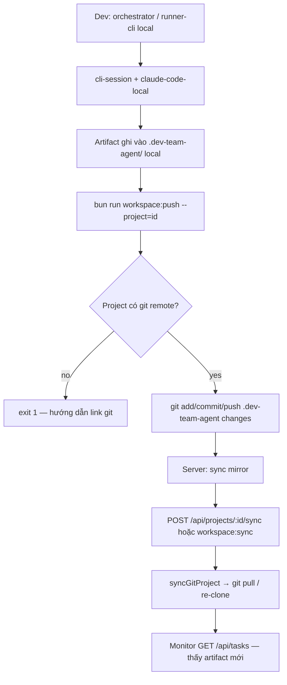
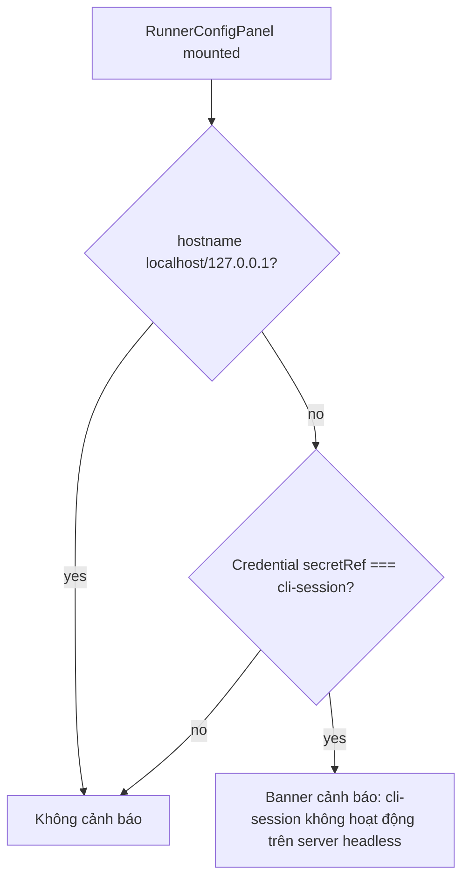

# Investigate — U0003-3

## 1. Tổng quan

Task **U0003-3** (subtask epic #39 / issue #42 — `[F0003.3] Runner hybrid — server CLI + dev sync`) hoàn thiện **Luồng A** (server runner headless) và **Luồng B** (dev runner local + đẩy artifact lên server mirror), dựa trên nền #40 (U0003 — server-ready) và #41 (U0003-2 — git workspace).

**Phụ thuộc đã merge (survey branch hiện tại):**
- U0003: `DEV_TEAM_API_TOKEN`, `/api/health`, `Dockerfile`, `docker-compose.yml`, `docs/deploy.md`
- U0003-2: `kind: 'git'`, `POST /api/projects/:id/sync`, `bun run workspace:sync`, `server/git/workspace.ts`

**IN scope (issue #42 — chỉ A + B):**

| # | Task | Luồng |
|---|---|---|
| 1 | Runner preset `claude-code-server` | A |
| 2 | Credential `env:ANTHROPIC_API_KEY` + doc deploy | A |
| 3 | UI cảnh báo `cli-session` trên non-localhost | A |
| 4 | `bun run workspace:push --project=<id>` | B |
| 5 | Conflict policy doc (1 task = 1 runner active) | B |
| 6 | Orchestrator doc: chọn runner theo env | B |

**OUT scope:**
- Luồng C — SSH remote runner (#44): provider `claude-code-ssh`, `kind: ssh`, `pull-cache` — **không implement** trong task này
- Cài đặt binary `claude` trên server image (ngoài dashboard) — chỉ document prerequisite
- UI settings nhập `ANTHROPIC_API_KEY` (credential đọc từ env process, không lưu secret qua REST)

**Trạng thái hiện tại (đã xác nhận trên branch):**

| Thành phần | Trạng thái | Evidence |
|---|---|---|
| Default runner | Chỉ `claude-code-local` + credential `cli-session` | `server/runners/registry.ts:16-35`, `server/runners/credentials.ts:23-34` |
| Preset `claude-code-server` | Không tồn tại | grep `claude-code-server` = 0 |
| `--bare` + env credential | Logic có sẵn trong provider | `server/runners/providers/claude-code-cli.ts:20-36` |
| `env:ANTHROPIC_API_KEY` profile | Không có trong default store | `credentials.ts:26-33` |
| `ANTHROPIC_API_KEY` trong deploy | Chưa document / chưa trong compose | `docs/deploy.md`, `docker-compose.yml` |
| UI cảnh báo cli-session | Không có | `RunnerConfigPanel.vue` — không check hostname |
| `workspace:sync` | Có | `package.json:14`, `scripts/workspace-sync.ts` |
| `workspace:push` | Không có | grep `workspace:push` = 0; không có `scripts/workspace-push.ts` |
| `runner-cli.mjs` | Có `--runner <id>` | `server/runner-cli.mjs:38,75` |
| Provider registry | Chỉ `claude-code-cli` | `server/runners/providerRegistry.ts:10` |
| SSH prep trong image | `openssh-client`, `rsync` đã cài (cho #44) | `Dockerfile:16` — không ảnh hưởng A/B |

**Mapping acceptance criteria:**

| AC | Ý nghĩa | Hướng implement |
|---|---|---|
| Server job + env credential → succeeded | Job queue chạy `claude-code-server` với `--bare` + `ANTHROPIC_API_KEY` set trên server | Preset + credential profile + doc env; smoke test qua UI/API |
| Dev push → server dashboard thấy artifact | Sau orchestrator local, dev push git → server `sync` → monitor đọc artifact | CLI `workspace:push` + (tuỳ chọn) trigger sync; dùng `syncGitProject` sẵn có |
| Luồng C (#44) không break khi merge | Không đổi contract `RunnerProvider`, giữ `file:` credential, không đụng SSH provider | Chỉ **thêm** preset/credential/CLI/doc; `claude-code-local` vẫn default |

## 2. Entry points

| Màn hình / Chức năng | UI trigger | Transport | Handler | File / evidence |
|---|---|---|---|---|
| Runner config | Sidebar → Runner | `GET/POST /api/runners`, credentials | `registerRunnerRoutes` | `src/App.vue:180-245`, `server/http/routes/runners.ts:25-48` |
| Smoke test job | RunnerConfigPanel → Smoke test | `POST /api/jobs?project=` | `submitJob` → `jobQueue.runJob` → `claude-code-cli.execute` | `RunnerConfigPanel.vue:124-152`, `runners.ts:80-101`, `jobQueue.ts:81-179` |
| Orchestrator submit (CLI) | Plugin gọi `runner-cli.mjs` | In-process job queue | `submitJob` / `submitAndWait` | `server/runner-cli.mjs:43-97` |
| Git sync server → mirror | ProjectBar → Đồng bộ | `POST /api/projects/:id/sync` | `syncGitProject` | `ProjectBar.vue:85`, `registry.ts:336-374` |
| Git sync CLI (server) | `bun run workspace:sync` | Script | `scripts/workspace-sync.ts` | `package.json:14` |
| Git push dev → remote (**mới**) | `bun run workspace:push --project=<id>` | Script (dự kiến) | `pushGitWorkspace` (dự kiến) | Chưa có |
| Monitor đọc artifact | Poll tasks | `GET /api/tasks?project=` | `registerTaskRoutes` | `src/App.vue` (poll 1.5s) |
| Deploy env runner | Docker / bare metal | Process env | `resolveSecretRef` → `process.env` | `credentials.ts:119-121`, `claude-code-cli.ts:30-36` |

## 3. Flow xử lý

### 3.1 Luồng A — Server runner (headless)



**Ghi chú kỹ thuật:**
- `cli-session` **tự động bỏ** `--bare` (`claude-code-cli.ts:24-26`) — preset server **bắt buộc** dùng credential `env:*`, không `cli-session`.
- Job workspace trên server thường là git clone: `DEV_TEAM_DASHBOARD_HOME/workspaces/<id>/` (hoặc path con `.dev-team-agent/tasks/<task-id>/`).
- `runner-cli.mjs` chọn runner qua `--runner <id>` (`runner-cli.mjs:75`); orchestrator trên server nên truyền `claude-code-server`.

### 3.2 Luồng B — Dev runner + workspace:push



**Giả định thiết kế (Medium confidence):** `workspace:push` chạy trên **máy dev**, dùng **local registry** (`~/.dev-team-dashboard/projects.json`) giống `workspace:sync.ts:12-15`. Project dev phải nằm trong git repo có remote khớp URL/branch với project `kind: 'git'` trên server (cùng repo). Push không thay thế `sync` — server vẫn cần pull mirror.

### 3.3 UI cảnh báo cli-session (non-localhost)



## 4. Phạm vi ảnh hưởng

### 4.1 DB / schema

| Table | Column | Trạng thái | Evidence |
|---|---|---|---|
| — | — | Không áp dụng | Runners/credentials/jobs lưu JSON dưới `DEV_TEAM_DASHBOARD_HOME/` (`runners.json`, `credentials.json`, `jobs/`); không có DB |

**Schema JSON mở rộng (on-disk, backward-compatible):**

```typescript
// runners.json — thêm entry (không đổi defaultRunnerId)
{ id: 'claude-code-server', provider: 'claude-code-cli', credentialId: 'claude-server-env',
  config: { cliPath: 'claude', flags: ['--bare'], ... } }

// credentials.json — thêm profile
{ id: 'claude-server-env', provider: 'claude-code-cli',
  label: 'Anthropic API Key (env)', secretRef: 'env:ANTHROPIC_API_KEY' }
```

Legacy install đã có `runners.json` → cần **seed idempotent** hoặc hướng dẫn tạo qua UI (xem §6).

### 4.2 Files cần sửa

**Backend — runner presets & credentials**

| File | Method / vị trí | Thay đổi dự kiến | Confidence |
|---|---|---|---|
| `server/runners/registry.ts` | `defaultRunners()` L16-36 | Thêm runner `claude-code-server`; **giữ** `defaultRunnerId: 'claude-code-local'` | High |
| `server/runners/credentials.ts` | `emptyStore()` L23-34 | Thêm profile `claude-server-env` với `secretRef: 'env:ANTHROPIC_API_KEY'` | High |
| `server/runners/registry.ts` | `loadRunners()` (tuỳ chọn) | `ensureBuiltinRunners()` merge preset nếu thiếu (idempotent) | Medium |
| `server/runners/credentials.ts` | `loadCredentials()` (tuỳ chọn) | Tương tự merge profile server-env | Medium |

**Backend — dev push (Luồng B)**

| File | Method / vị trí | Thay đổi dự kiến | Confidence |
|---|---|---|---|
| `server/git/push.ts` **(mới)** | `findGitRoot`, `pushDevTeamArtifacts`, `pushGitWorkspace(id)` | Từ `project.path` walk lên git root; `git add` paths `.dev-team-agent/`; commit message chuẩn; `git push origin <branch>`; validate remote URL khớp `project.source` nếu `kind==='git'` | Medium |
| `server/registry.ts` | export `pushGitWorkspace` (wrapper) | Delegate git push; lock tương tự sync (hoặc doc single-writer) | Medium |
| `scripts/workspace-push.ts` **(mới)** | `main()` | Mirror `workspace-sync.ts`: parse `--project=`, gọi push logic | High |
| `package.json` | `scripts` | `"workspace:push": "bun scripts/workspace-push.ts"` | High |

**Frontend — UI cảnh báo**

| File | Method / vị trí | Thay đổi dự kiến | Confidence |
|---|---|---|---|
| `src/features/runner/components/RunnerConfigPanel.vue` | script + template | `isNonLocalHost` từ `window.location.hostname`; `showCliSessionWarning` khi credential `secretRef==='cli-session'`; banner tiếng Việt | High |
| `src/shared/lib/host.ts` **(mới, tuỳ chọn)** | `isLocalDashboardHost()` | Pure fn test được vitest | Medium |

**Docs (bắt buộc theo issue)**

| File | Thay đổi dự kiến | Confidence |
|---|---|---|
| `docs/deploy.md` | § Runner server: `ANTHROPIC_API_KEY`, `claude` trong PATH, preset `claude-code-server`, set default runner trên server; § Luồng B: `workspace:push` + `workspace:sync`; conflict policy 1 task = 1 runner; bảng chọn luồng A/B/C | High |
| `docker-compose.yml` | Optional `ANTHROPIC_API_KEY: ${ANTHROPIC_API_KEY:-}` (comment) | Medium |
| `docs/knowhow/orchestrator-runners.md` **(mới, hoặc section deploy)** | `runner-cli.mjs --runner claude-code-local` (dev) vs `claude-code-server` (server); env gợi ý `DEV_TEAM_RUNNER_ID` | Medium |

**Tests**

| File | Thay đổi dự kiến | Confidence |
|---|---|---|
| `tests/server/runners/runners.test.ts` | Default store có thêm `claude-code-server` + credential env profile | High |
| `tests/server/git/push.test.ts` **(mới)** | Mock `runGit`: push args, reject non-git, URL mismatch | High |
| `tests/server/runners/claude-code-cli.test.ts` **(mới, tuỳ chọn)** | `resolveEffectiveFlags`: env giữ `--bare`, cli-session bỏ `--bare` | Medium |
| `tests/src/features/runner/RunnerConfigPanel.test.ts` **(mới, tuỳ chọn)** | Vitest: warning khi hostname ≠ localhost + cli-session | Low |

**Có thể bị ảnh hưởng (ngoài scope MVP, không sửa trừ regression)**

| File | Lý do |
|---|---|
| `server/runners/providers/claude-code-cli.ts` | Chỉ đọc — logic `--bare`/env đã đủ; #44 sẽ reuse `buildPrompt` |
| `server/runners/providerRegistry.ts` | #44 sẽ `register(createClaudeCodeSshProvider())` — không đụng trong U0003-3 |
| `server/runner-cli.mjs` | Doc only — đã hỗ trợ `--runner` |
| `Dockerfile` | Đã có `git`, `openssh-client`, `rsync` — không cần đổi cho A/B |

### 4.3 Blast radius

- **Default runner không đổi:** `defaultRunnerId` vẫn `claude-code-local` → CI, local dev, `runners.test.ts` smoke path **không spawn CLI thật** (agent ref invalid trước spawn) — backward compatible.
- **Existing `runners.json`:** User đã customize **không** tự nhận preset mới nếu chỉ sửa `defaultRunners()` — cần seed idempotent hoặc doc "tạo runner qua UI". Risk Medium.
- **Credential API:** Vẫn chỉ expose `secretRef` string, không trả `process.env` value (`runners.ts:57-58` audit id-only) — không đổi.
- **Job queue global:** Runners/jobs không scope `?project=` (trừ POST job cần root) — server runner và dev runner dùng chung store `DEV_TEAM_DASHBOARD_HOME` trên từng máy — đúng thiết kế.
- **Git push từ dev:** Có thể conflict nếu server job và dev push cùng task-id — **doc policy** "1 task = 1 runner active" (issue #39 § Rủi ro); không implement distributed lock trong MVP.
- **Luồng C (#44):** `file:` secretRef đã có (`credentials.ts:123-124`); `Dockerfile` đã cài `openssh-client`/`rsync`; không thêm provider SSH → **không block** #44.
- **`syncGitProject` re-clone:** Push dev rồi server pull — nếu pull fail → re-clone xóa local server edits (đúng mirror semantics U0003-2) — không regression.
- **Server container thiếu `claude` binary:** Job failed runtime — document prerequisite, không phải bug dashboard.

## 5. Test coverage hiện tại

| Khu vực | Coverage | Ghi chú |
|---|---|---|
| Runners CRUD + job queue | `tests/server/runners/runners.test.ts` | Default `claude-code-local`; không test execute/spawn thật |
| `resolveSecretRef` / flags | `runners.test.ts:84-91` | Có env/cli-session/file; chưa test integration với provider |
| Git sync | `tests/server/registry.test.ts` L182-240 | `addFromGit`, `syncGitProject` mocked git |
| HTTP runners/jobs | Không có golden riêng | Chỉ gián tiếp qua app stubs |
| `workspace-sync` CLI | Không có test script | Logic gọi `syncGitProject` — nên mirror test cho push |
| `workspace:push` | 0 | Surface mới |
| RunnerConfigPanel UI | 0 vitest | Cảnh báo cli-session chưa cover |
| E2E runner | Không có | Playwright fixture không test job thật |

**Test đề xuất P0 (theo acceptance criteria):**

1. Fresh `loadRunners()` / `loadCredentials()` chứa `claude-code-server` + `claude-server-env` (`env:ANTHROPIC_API_KEY`); `defaultRunnerId` vẫn `claude-code-local`
2. `resolveEffectiveFlags(['--bare'], env credential)` giữ `--bare`; với `cli-session` bỏ `--bare`
3. Mock provider execute: `buildChildEnv` set `ANTHROPIC_API_KEY` khi env có giá trị
4. `pushGitWorkspace` (mock git): commit paths dưới `.dev-team-agent/`, `git push origin <branch>`
5. `pushGitWorkspace` với `kind: 'local'` nhưng có git root → push OK (Medium) hoặc 400 nếu thiếu remote (design chọn)
6. Regression: `syncGitProject`, `claude-code-local` job submit vẫn queue (status failed trước spawn nếu agent invalid — như hiện tại)
7. Vitest (tuỳ chọn P1): `isLocalDashboardHost('app.example.com')` → warning path

**Test manual (ngoài CI):** Server có `claude` + `ANTHROPIC_API_KEY` → smoke test UI succeeded; dev push + server sync → monitor thấy `investigate.md` mới.

## 6. Rủi ro và điểm cần xác nhận

| Rủi ro | Confidence | Ghi chú |
|---|---|---|
| Install `runners.json` cũ không có preset server | High | Cần `ensureBuiltinRunners` hoặc doc migration |
| Container không có `claude` CLI | High | `Dockerfile` không cài Claude Code — AC "succeeded" cần host có CLI |
| `ANTHROPIC_API_KEY` unset → job fail opaque | High | UI smoke test / log nên gợi ý check env |
| `workspace:push` cần git write credential trên dev | High | HTTPS public push có thể cần `GIT_TOKEN` — ngoài MVP #41 |
| Push + server job đồng thời cùng task-id | Medium | Doc conflict policy; không lock code |
| Push chỉ `.dev-team-agent` vs cả repo | Medium | Nên commit scoped `.dev-team-agent/**` để tránh accidental files |
| `workspace:push` có auto-gọi server `sync` API không | Medium | Issue AC gợi ý end-to-end "dashboard thấy artifact" — flag `--sync` hoặc doc 2 bước |
| Hostname check UI: `127.0.0.1` vs `localhost` vs LAN IP | High | Cần whitelist rõ (`localhost`, `127.0.0.1`, `[::1]`) |
| Windows dev `git push` shell | Medium | `defaultRunGit` đã `shell: win32` — reuse pattern |

## 7. Câu hỏi chưa rõ

| # | Câu hỏi | Blocking? |
|---|---|---|
| 1 | `workspace:push` có bắt buộc gọi `POST /api/projects/:id/sync` trên server (cần URL + token) hay operator sync thủ công? | Không — designer chọn `--sync-server` optional + doc 2 bước |
| 2 | Seed preset server vào install đã tồn tại: `ensureBuiltinRunners()` tự merge hay chỉ fresh `defaultRunners()`? | Không — merge idempotent UX tốt hơn |
| 3 | `workspace:push` áp dụng cho `kind: 'local'` (dev path) hay bắt buộc `kind: 'git'` trên dev registry? | Không — MVP: local path trong git repo + remote khớp server |
| 4 | Doc orchestrator: file riêng `docs/knowhow/orchestrator-runners.md` hay mở rộng `deploy.md`? | Không — một section deploy đủ MVP |
| 5 | Set `claude-code-server` làm default trên server qua env `DEV_TEAM_DEFAULT_RUNNER`? | Không — issue chỉ preset + doc; có thể defer |

Không có câu hỏi blocking — **không tạo `qa.md`**.
