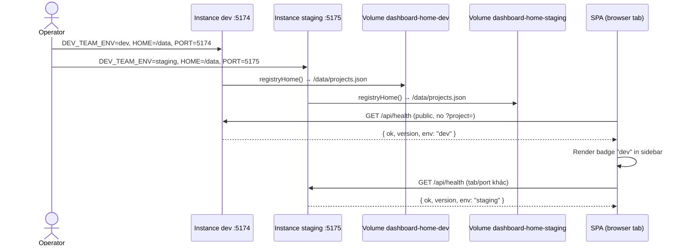

# Investigate — U0003-4

## 1. Tổng quan

Task **U0003-4** (subtask của #39 / issue #43 — `[F0003.4] Multi-environment ops`) bổ sung khả năng vận hành **nhiều instance dashboard trên cùng host**, mỗi instance gắn một môi trường (`dev`, `staging`, `prod-team`, …), registry độc lập, operator có thể backup/restore dữ liệu dashboard.

**Phụ thuộc:** #40 (U0003), #41 (U0003-2), #42 (U0003-3) — đã merge vào `feat/U0003/main` (theo context orchestrator).

### Đã có sẵn (partial work từ U0003)

| Hạng mục | Trạng thái | Evidence |
|---|---|---|
| `DEV_TEAM_ENV` → `/api/health` | **Done** | `server/http/routes/config.ts:32-41` |
| Zod schema `HealthResponse.env?` | **Done** | `shared/schemas/health.ts:3-7` |
| `docker-compose.yml` truyền `DEV_TEAM_ENV` | **Done** | `docker-compose.yml:11` |
| `docs/deploy.md` nhắc `DEV_TEAM_ENV` 1 dòng | **Partial** | `docs/deploy.md:16` — chưa có convention multi-instance / backup |
| Test health cơ bản | **Partial** | `tests/server/http/health.test.ts:35-44` — chưa assert `env` khi set |

### Còn lại (scope #43)

| # | Task issue | Trạng thái |
|---|---|---|
| 1 | UI sidebar badge env (đọc `/api/health`) | **Chưa có** — grep `src/` không match `health`/`DEV_TEAM_ENV` |
| 2 | `docs/deploy.md` — naming instance, volume per env, backup/restore | **Chưa đủ** |
| 3 | `scripts/backup-dashboard-home.sh` | **Chưa tồn tại** — repo không có file `.sh` |
| 4 | (Optional) GHA build + push Docker image | **Chưa có** — chỉ `.github/workflows/ci.yml` |

**IN scope:**
1. Hoàn thiện expose `DEV_TEAM_ENV` (test coverage) + badge UI sidebar
2. Mở rộng `docs/deploy.md`: convention đặt tên instance/volume, hướng dẫn 2 instance cùng host, backup/restore
3. Script backup `DEV_TEAM_DASHBOARD_HOME`
4. (Optional) workflow Docker publish

**OUT scope:**
- Distributed lock / conflict policy giữa env (đã cover ở #42 §9)
- SSH remote runner (#44)
- Thay đổi schema registry hoặc logic project resolution
- UI settings nhập `DEV_TEAM_ENV` (env chỉ set server-side)

## 2. Entry points

| Màn hình / Chức năng | UI trigger | Transport | Handler | File / evidence |
|---|---|---|---|---|
| Health check (public) | `curl /api/health` | HTTP GET | `registerConfigRoutes` → `GET /api/health` | `server/http/routes/config.ts:32-41` |
| Env badge sidebar (mới) | SPA mount / refresh | `fetch('/api/health')` | — (chưa có FE) | `src/App.vue:121-138` (vị trí brand header) |
| Registry per instance | Mọi `/api/*` scoped project | HTTP | `registryHome()` → `DEV_TEAM_DASHBOARD_HOME` | `server/registry.ts:70-73` |
| Multi-instance deploy | Operator `docker compose` | Container env + volumes | `docker-compose.yml` | `docker-compose.yml:6-17` |
| Backup dashboard home (mới) | Operator chạy script | Shell | `scripts/backup-dashboard-home.sh` (chưa có) | — |
| CI hiện tại | push/PR | GHA | `ci.yml` — build/test, không push image | `.github/workflows/ci.yml` |

## 3. Flow xử lý

### 3.1 Runtime — 2 instance cùng host



**Cơ chế isolation registry:** `registryHome()` resolve từ `DEV_TEAM_DASHBOARD_HOME` (`server/registry.ts:70-73`). Mỗi container/instance mount volume riêng → `projects.json`, `workspaces/`, `runners.json`, `jobs/`, `logs/` độc lập. Port khác nhau qua `DEV_TEAM_DASHBOARD_PORT` + mapping compose (`server/standalone.ts:31-32`).

### 3.2 Backend — `/api/health` trả `env`

```
Process start
  → GET /api/health [config.ts:32]
  → envRaw = process.env.DEV_TEAM_ENV?.trim() [config.ts:33]
  → body = { ok: true, version, ...(envRaw ? { env: envRaw } : {}) } [config.ts:34-37]
  → HealthResponseSchema.safeParse(body) [config.ts:39]
  → 200 JSON (không gọi unknownProject, không cần ?project=)
```

Auth bypass khi token set: `server/http/middleware/auth.ts:37-39`, `server/http/createApiHandler.ts:61`.

### 3.3 Backup operator flow (dự kiến)

```
Operator
  → scripts/backup-dashboard-home.sh
  → đọc DEV_TEAM_DASHBOARD_HOME (hoặc arg)
  → tar.gz toàn bộ thư mục home (projects.json, workspaces/, runners/, jobs/, logs/, credentials.json)
  → stdout path archive + exit 0
```

Restore: doc hướng dẫn giải nén vào volume mới + restart container (không cần script restore riêng cho MVP nếu doc đủ rõ).

## 4. Phạm vi ảnh hưởng

### 4.1 DB / schema

| Table | Column | Trạng thái | Evidence |
|---|---|---|---|
| — | — | Không áp dụng | Dashboard dùng filesystem; registry JSON tại `$DEV_TEAM_DASHBOARD_HOME/projects.json` |

**Nội dung `DEV_TEAM_DASHBOARD_HOME` cần backup** (xác nhận từ code):

| Path con | Module | Evidence |
|---|---|---|
| `projects.json` | Registry | `server/registry.ts:76-77` |
| `workspaces/<id>/` | Git clone | `server/git/workspace.ts:16` |
| `runners.json` | Runner config | `server/runners/registry.ts:13` |
| `credentials.json` | Runner credentials | `server/runners/credentials.ts:20` |
| `jobs/` | Job queue + logs | `server/runners/jobQueue.ts:22`, `server/logging/jobLog.ts:23` |
| `logs/` | Audit/request logs | `server/logging/store.ts:21-22` |

### 4.2 Files cần sửa

**Backend — đã xong / chỉ bổ sung test**

| File | Method / vị trí | Thay đổi dự kiến | Confidence |
|---|---|---|---|
| `server/http/routes/config.ts` | `GET /api/health` | **Không cần sửa logic** — đã expose `DEV_TEAM_ENV` | High |
| `shared/schemas/health.ts` | `HealthResponseSchema` | **Không cần sửa** — đã có `env?` | High |
| `docker-compose.yml` | `environment` | Có thể thêm comment / ví dụ multi-file compose | Medium |
| `tests/server/http/health.test.ts` | describe health | Thêm case: `DEV_TEAM_ENV=staging` → body.env; unset → không có key `env` | High |

**Frontend — badge sidebar (chưa có)**

| File | Method / vị trí | Thay đổi dự kiến | Confidence |
|---|---|---|---|
| `src/api/client.ts` | export mới | `fetchHealth()` gọi `/api/health` (public, không cần token — endpoint bypass auth) | High |
| `src/App.vue` | `onMounted`, brand header L121-138 | Fetch health once (hoặc composable nhẹ); render `<span class="env-badge">` khi `env` có | High |
| `src/style.css` | sidebar `.brand` | Style badge env (tương tự `.badge` hiện có L163-167) | High |

**Deploy & ops (mới / mở rộng)**

| File | Thay đổi dự kiến | Confidence |
|---|---|---|
| `docs/deploy.md` | Section mới: multi-env naming (`dashboard-dev`, `dashboard-staging`), volume naming (`dashboard-home-dev`), port map, ví dụ 2 compose service, backup/restore checklist | High |
| `scripts/backup-dashboard-home.sh` **(mới)** | `tar czf` `$DEV_TEAM_DASHBOARD_HOME`; validate dir tồn tại; output timestamped archive | High |
| `docker-compose.staging.example.yml` **(tuỳ chọn)** | Ví dụ second instance — có thể gộp vào doc thay vì file riêng | Medium |
| `.github/workflows/docker-publish.yml` **(optional)** | build + push GHCR/Docker Hub on tag | Medium |

**Tests bổ sung**

| File | Thay đổi dự kiến | Confidence |
|---|---|---|
| `tests/src/api/client.test.ts` **(mới hoặc mở rộng)** | Vitest: `fetchHealth` parse response | Medium |
| `tests/App.test.ts` **(tuỳ chọn)** | Badge render khi mock health có `env` | Low |
| `test-e2e/*.spec.ts` **(tuỳ chọn P1)** | E2E với `DEV_TEAM_ENV` — playwright webServer env | Low |

**Có thể bị ảnh hưởng (ngoài scope MVP)**

| File | Lý do |
|---|---|
| `mcp/server.ts` | MCP dùng chung `registryHome()` — mỗi MCP process cần `DEV_TEAM_DASHBOARD_HOME` đúng instance; không đổi code |
| `playwright.config.ts` | E2E boot standalone — có thể set `DEV_TEAM_ENV=test` để verify badge |
| `vite.config.js` | Dev mode cũng serve `/api/health` qua middleware — badge hiện khi dev set env |

### 4.3 Blast radius

- **Registry isolation:** Phụ thuộc hoàn toàn vào operator mount **volume/`DEV_TEAM_DASHBOARD_HOME` khác nhau** per instance — code không enforce; doc phải nêu rõ (acceptance criteria).
- **Backward compatible:** Khi `DEV_TEAM_ENV` unset → `/api/health` không có field `env` (`config.ts:37` spread conditional); UI **không** hiện badge — hành vi local dev/CI không đổi.
- **Health public:** Badge fetch không cần API token dù deploy có `DEV_TEAM_API_TOKEN` — endpoint đã bypass auth.
- **Không lộ secret:** Chỉ expose label operator-set (`DEV_TEAM_ENV`), không đọc thêm biến `DEV_TEAM_*` khác — khác với câu hỏi U0003 design (NODE_ENV); implementation hiện tại dùng `DEV_TEAM_ENV` đúng issue #43.
- **Backup script:** Chỉ đọc filesystem; cần quyền đọc `$DEV_TEAM_DASHBOARD_HOME`; không stop container — doc nên khuyên backup khi idle hoặc chấp nhận snapshot eventually-consistent.
- **Optional GHA:** Không ảnh hưởng CI hiện tại nếu workflow riêng trigger `workflow_dispatch` / tag.

## 5. Test coverage hiện tại

| Khu vực | Coverage | Ghi chú |
|---|---|---|
| `GET /api/health` shape cơ bản | `tests/server/http/health.test.ts:35-44` | Có `ok`, `version`; **thiếu** case `DEV_TEAM_ENV` |
| Auth bypass health | `tests/server/http/auth.test.ts:95-97` | Token set vẫn 200 health |
| `HealthResponseSchema` | Không có file test riêng | U0003 design đề xuất `tests/shared/schemas/health.test.ts` — chưa tồn tại |
| FE health / badge | Không có | `src/api/client.ts` không có `fetchHealth` |
| Backup script | Không có | Script chưa tồn tại |
| Multi-instance manual | Không automate | Acceptance criteria yêu cầu smoke 2 instance — doc + manual checklist |
| CI Docker publish | Không có | Optional task #43.4 |

**Test đề xuất P0 (theo acceptance criteria #43):**

1. `DEV_TEAM_ENV=staging` → `GET /api/health` → 200, `env === 'staging'`
2. Unset `DEV_TEAM_ENV` → response không có property `env`
3. Vitest/component: sidebar hiện badge `"staging"` khi health mock trả `env`
4. Manual/doc: 2 compose instance khác port + volume → registry độc lập (add project trên dev không xuất hiện staging)
5. `scripts/backup-dashboard-home.sh` smoke: tạo temp home → backup → archive chứa `projects.json`
6. Doc restore: giải nén vào volume mới → container start → registry intact

**Test P1 (optional):** GHA workflow dry-run build; E2E screenshot badge (attach playwright report, không commit `docs/`).

## 6. Rủi ro và điểm cần xác nhận

| Rủi ro | Confidence | Ghi chú |
|---|---|---|
| Operator quên tách volume → 2 env dùng chung registry | High | Giải bằng doc convention + ví dụ compose rõ ràng |
| Badge stale nếu chỉ fetch once at mount | Medium | Env không đổi runtime — fetch once đủ; có thể re-fetch khi reconnect |
| Backup tar while writes active | Medium | Doc khuyến nghị stop container hoặc chấp nhận risk |
| Windows dev không chạy `.sh` | Medium | Script target Linux server deploy; doc ghi bash + WSL note |
| `addGitProject`/`syncProject` trong `client.ts` không dùng `apiFetch` | Low | Pre-existing; không thuộc #43 |
| Optional GHA cần secrets/registry | Medium | Out of MVP nếu chưa có infra |

## 7. Câu hỏi chưa rõ

| # | Câu hỏi | Blocking? |
|---|---|---|
| 1 | Badge hiển thị ở collapsed sidebar (chỉ icon) hay ẩn khi thu gọn? | Không — designer chọn: tooltip hoặc chữ viết tắt trên rail |
| 2 | Màu badge theo env cố định (dev=xanh, staging=vàng) hay neutral? | Không — MVP neutral badge đủ acceptance |
| 3 | GHA push image lên registry nào (GHCR vs Docker Hub)? | Không — optional; có thể ship sau |
| 4 | Cần script `restore-dashboard-home.sh` riêng hay chỉ doc `tar xzf`? | Không — issue chỉ yêu cầu backup script + restore **doc** |

Không có câu hỏi blocking — **không tạo `qa.md`**.
