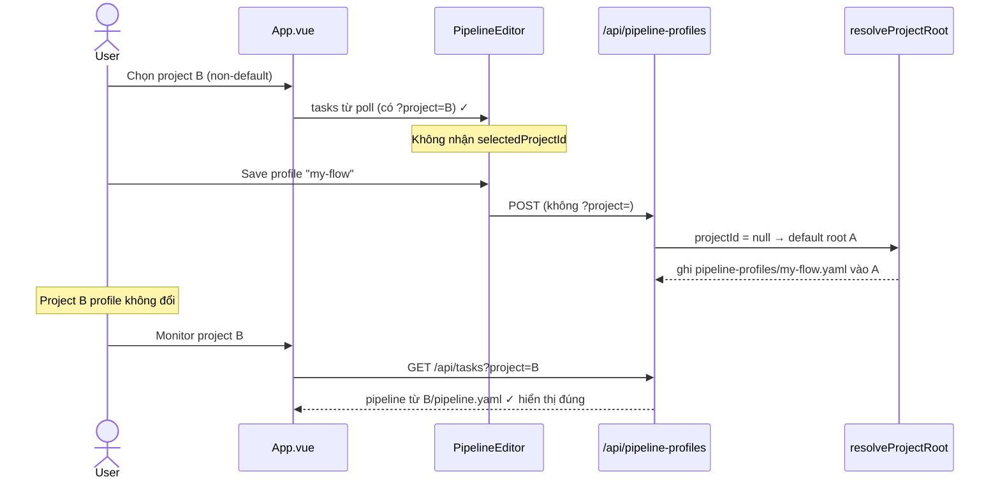
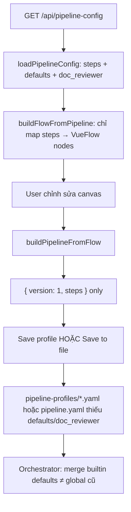

# Investigate — U0004

## 1. Tổng quan

Bug: **lưu pipeline profile từ dashboard không phản ánh đúng setting vào profile local của project** — monitor vẫn hiển thị đúng (đọc `pipeline.yaml` đã resolve qua `?project=`), nhưng orchestrator / file profile trên project chạy sai.

Survey xác định **hai nguyên nhân độc lập**, cùng contribute:

| # | Nguyên nhân | Confidence | Triệu chứng khớp user report |
|---|---|---|---|
| A | Pipeline Editor **không truyền `?project=`** cho mọi API profile / pipeline-config | **High** | Profile ghi vào root **default**, không phải project đang chọn; monitor đọc đúng project |
| B | `buildPipelineFromFlow()` chỉ serialize `{ version, steps }`, **bỏ `defaults` và `doc_reviewer`** | **High** | Profile / `pipeline.yaml` sau Save thiếu setting; orchestrator merge từ builtin default |

**IN scope:** sửa luồng lưu/load profile và Save to file trong Pipeline Editor; đảm bảo round-trip đầy đủ pipeline schema; test regression.

**OUT scope:** orchestrator đọc trực tiếp từ `pipeline-profiles/` (orchestrator chỉ đọc `pipeline.yaml` — không đổi contract orchestrator); flow-profile (chỉ lưu vị trí node monitor).

## 2. Entry points

| Màn hình | UI trigger | API | Handler | File |
|---|---|---|---|---|
| Pipeline Editor — Save profile | ProfileManager → Save | `POST /api/pipeline-profiles` | `registerConfigRoutes` L43 | `ProfileManager.vue:40-54`, `config.ts:43-57` |
| Pipeline Editor — Load profile | ProfileManager → Load | `GET /api/pipeline-profiles?name=` | `config.ts:14-27` | `ProfileManager.vue:29-37` |
| Pipeline Editor — Save to file | Toolbar → Save to file | `POST /api/pipeline-config-write` | `config.ts:75-105` | `PipelineEditor.vue:337-349` |
| Pipeline Editor — Load config | onMounted / scope change | `GET /api/pipeline-config` | `tasks.ts:22-27` → `loadPipelineConfig` | `PipelineEditor.vue:110-116` |
| Monitor — hiển thị pipeline | Poll tasks | `GET /api/tasks?project=` | `collectTasks` → `loadPipelineConfig` | `App.vue:35`, `tasks/index.ts:84` |
| Orchestrator runtime | đọc filesystem | — | `pipeline.yaml` ← builtin | `server/pipeline/index.ts:13-44` |

## 3. Flow xử lý

### 3.1 Bug A — thiếu `?project=` (multi-project)

**Evidence:**

- `App.vue:230-237` — `PipelineEditor` chỉ nhận `scope`, `taskId`, `tasks`; **không** có `selectedProjectId`.
- `client.ts:149-184` — `fetchPipelineProfiles`, `savePipelineProfile`, `writePipelineConfig` **không** có tham số `projectId` (khác `fetchTasks`, `fetchArtifact`, `fetchPipelineConfig` có `projectId?`).
- `PipelineEditor.vue:112` — `fetchPipelineConfig(id)` gọi không project.
- `server/http/app.ts:22-26` — thiếu `?project=` → `resolveProjectRoot(null)` = default project.

### 3.2 Bug B — mất `defaults` / `doc_reviewer` khi serialize

**Evidence:**

- `PipelineEditor.vue:119-147` — `buildFlowFromPipeline` chỉ đọc `pipeline.steps`.
- `PipelineEditor.vue:299-320` — `buildPipelineFromFlow` return `{ version: 1, steps }`.
- `server/pipeline/index.ts:17-21` — orchestrator merge `global.defaults`, `global.doc_reviewer` từ file; nếu file không có → dùng builtin.
- Repo `pipeline.yaml` hiện tại có `defaults` + `doc_reviewer` đầy đủ; profile mới save sẽ thiếu.

### 3.3 Vì sao monitor “đúng” nhưng project “sai”

1. **Monitor** embed `task.pipeline` từ `loadPipelineConfig(root, taskId)` qua `/api/tasks?project=X` — đọc `pipeline.yaml` trên disk của project X, **chưa bị ghi đè** nếu user chỉ Save profile (và profile ghi nhầm root default).
2. **Orchestrator** đọc `pipeline.yaml` (và per-task override). Nếu user Load profile → Save to file, hoặc copy profile thiếu field → `pipeline.yaml` mất settings → runtime sai (`auto_review`, `doc_reviewer.rule_required`, v.v.).
3. Nếu user kỳ vọng file trong `project/.dev-team-agent/pipeline-profiles/` được cập nhật khi Save profile trên project B → Bug A khiến file ghi ở default root.

## 4. Blast radius

| File / module | Thay đổi dự kiến |
|---|---|
| `src/api/client.ts` | Thêm `projectId?` cho pipeline-profiles + pipeline-config-write |
| `src/features/pipeline-editor/components/PipelineEditor.vue` | Giữ `pipelineMeta` (defaults, doc_reviewer); round-trip trong build/save; nhận `projectId` prop |
| `src/features/pipeline-editor/components/ProfileManager.vue` | Truyền `projectId` xuống API (hoặc inject từ parent) |
| `src/App.vue` | Pass `selectedProjectId` → PipelineEditor |
| `tests/src/` hoặc `tests/server/http/` | Test round-trip defaults; test `?project=` trên profile save |
| `server/http/routes/config.ts` | Không đổi (đã scope theo `c.get('root')`) |

**Không ảnh hưởng:** `flow-profiles/` (monitor layout), orchestrator merge logic (đã đúng), `DEFAULT_PIPELINE`.

## 5. Test coverage hiện tại

| Test | Ghi chú |
|---|---|
| `tests/server/http/app.request.test.ts` L118 | POST profile với `{ steps: [] }` only — không assert defaults |
| `tests/server/http/api.golden.test.ts` L200 | pipeline-config-write global — không assert defaults preserved |
| `tests/src/api/phase.test.ts` | phasesFromPipeline — không cover editor serialize |

**Gap:** không có test multi-project profile scope; không có test editor round-trip `defaults`/`doc_reviewer`.

## 6. Acceptance criteria

1. Khi chọn project B trên dashboard, Save/Load/Delete profile ghi đọc `B/.dev-team-agent/pipeline-profiles/`, không phải default root.
2. Save profile và Save to file giữ nguyên `defaults` (ít nhất `auto_review`, `export_json`, `review_retry_max`) và `doc_reviewer` từ config đã load (hoặc builtin nếu chưa có).
3. Load profile đã lưu → Save to file → `GET /api/pipeline-config?project=B` trả pipeline tương đương config gốc (steps + defaults + doc_reviewer).
4. Monitor và orchestrator đọc cùng một `pipeline.yaml` sau thao tác Save to file — không lệch setting.
5. Regression: single-project mode (không `?project=`) vẫn hoạt động như trước.

## 7. Câu hỏi / rủi ro

| # | Câu hỏi | Đề xuất |
|---|---|---|
| 1 | Editor có cần UI chỉnh `defaults`/`doc_reviewer` không? | Phase 1: preserve round-trip silent; UI riêng optional sau |
| 2 | Load profile có auto-write `pipeline.yaml` không? | Không — chỉ Load vào canvas; user Save to file thủ công (giữ hành vi hiện tại) |
