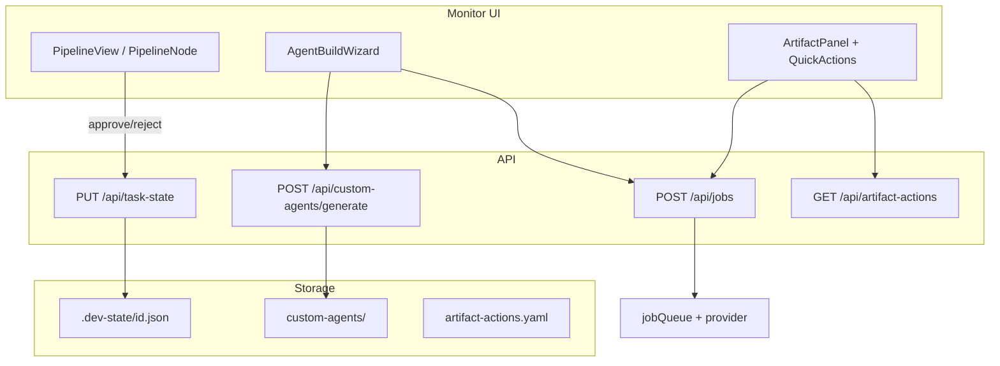
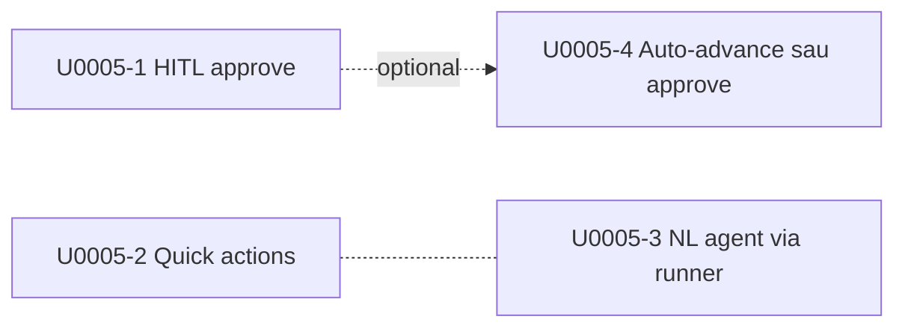

# Design — U0005: Tích hợp agent vào pipeline dashboard

## §1. Tổng quan

Mở rộng dev-team-dashboard để người dùng **duyệt HITL**, **tạo và chạy agent từ mô tả tự nhiên**, và **kích hoạt tác vụ agent nhanh** ngay trên màn hình monitor — không bắt buộc quay lại orchestrator CLI. Giải pháp tận dụng job queue và API runner đã có, bổ sung API ghi task state an toàn, UI tương tác trên pipeline node và artifact toolbar. Orchestrator plugin giữ nguyên contract state; dashboard trở thành control plane bổ sung.

## §2. Investigation Summary

- Dashboard **chỉ đọc** `.dev-state/*.json`; HITL approve hiện chỉ qua orchestrator chat.
- `PipelineNode` hiển thị icon status nhưng không clickable; `phaseStatus` đã phân biệt `waiting` đúng.
- `POST /api/jobs` + `agentResolver` + `POST /api/custom-agents/generate` đủ cho chạy agent và NL draft.
- `ArtifactPanel` chưa có quick actions; `workflow-step-templates` là điểm mở rộng tự nhiên.
- Rủi ro chính: race state khi CLI và dashboard cùng sửa task — giảm bằng optimistic concurrency (`mtime`) và audit.

## §3. So sánh giải pháp

### 3.1 HITL approve trên monitor

| Giải pháp | Ưu điểm | Nhược điểm | Quyết định |
|---|---|---|---|
| **A. Dashboard ghi state + user resume orchestrator** | Ít đụng plugin; atomic API trong repo này | Cần bước resume thủ công hoặc tách | ✅ Phase 1 |
| B. Dashboard gọi orchestrator headless sau approve | End-to-end tự động | Phụ thuộc remote runner + coupling chặt | Phase 2 |
| C. Chỉ hiển thị link "mở chat approve" | Không code backend | Không đáp ứng yêu cầu click icon | ❌ |

### 3.2 NL agent build

| Giải pháp | Ưu điểm | Nhược điểm | Quyết định |
|---|---|---|---|
| **A. Wizard monitor: generate → preview → save → test job** | UX một luồng; tái dùng API | 2–3 màn modal | ✅ |
| B. Chỉ deep-link sang Agent Editor | Ít code | Không "qua runner" như yêu cầu | ❌ |
| C. Runner tự generate trong prompt | 1 job | Khó preview/sửa draft trước khi lưu | ❌ |

### 3.3 Quick actions artifact

| Giải pháp | Ưu điểm | Nhược điểm | Quyết định |
|---|---|---|---|
| **A. Config `artifact-actions.yaml` + job submit** | Declarative; mở rộng không sửa Vue | Cần schema mới | ✅ |
| B. Hardcode nút theo tên file | Nhanh MVP | Không scalable | ❌ |
| C. Mở rộng `workflow-step-templates` | Tái dùng CRUD có sẵn | Field thiếu `agentRef`/artifact filter | Dùng làm base, extend schema |

## §4. Implementation Details

### 4.1 Kiến trúc tổng thể



### 4.2 Feature 1 — Click icon flow để duyệt HITL

#### Backend

**File mới / sửa**

| File | Thay đổi |
|---|---|
| `shared/schemas/task.ts` | Thêm `TaskStatePatch` schema: `action: 'approve' \| 'reject'`, `gate_id`, optional `feedback`, `mtime` |
| `server/tasks/state.ts` (mới) | `readState`, `writeStateAtomic`, `applyHitlAction(state, pipeline, action)` |
| `server/http/routes/tasks.ts` | `PUT /api/task-state?id=<task-id>` |

**Logic `applyHitlAction` (approve)**

1. Validate `task.hitl_pending === gate_id` từ body (hoặc derive từ pipeline step có `hitl.gate_id`).
2. Load pipeline config (`loadPipelineConfig`).
3. Tìm step hiện tại có `hitl.gate_id === hitl_pending`.
4. Approve:
   - `hitl_pending = null`
   - `current_phase = nextStep.id` (hoặc `completed` nếu step cuối)
   - Optional: set flag `dashboard_approved_at` trong state (passthrough field) cho audit.
5. Reject + feedback: giữ `current_phase`, `hitl_pending = null`, ghi `tasks/<id>/hitl-feedback.md` hoặc append vào state `last_feedback` — orchestrator resume sẽ đọc khi spawn lại agent.

**Optimistic concurrency**: client gửi `mtime` từ `state_mtime` trong `/api/tasks`; conflict → 409 + state hiện tại.

**Audit**: `emitAudit({ op: 'update', entity: 'task-state', identifier: id })`.

#### Frontend

| File | Thay đổi |
|---|---|
| `PipelineNode.vue` | `@click` trên bubble khi `status === 'waiting'`; emit `hitl-action` |
| `PipelineView.vue` | Modal/popover: "Duyệt phase X?", nút Duyệt / Từ chối + textarea feedback; gọi `approveHitl()` |
| `src/api/client.ts` | `patchTaskState(taskId, body, projectId?)` |
| `MonitorLayout.vue` | Refresh poll sau approve; toast kết quả |

**UX chi tiết**

- Icon `⏸` (waiting) có `cursor: pointer`, tooltip "Click để duyệt".
- Sau approve: node chuyển `active`/`done`; badge header mất `hitl_pending`.
- Nếu step có `optional_doc_review`: sau approve hiện dialog "Chạy doc-review?" (yes → submit job doc-reviewer — phase 1b hoặc defer).

#### Sync remote (Luồng B)

Sau `PUT /api/task-state` thành công, nếu project có remote sync config → gọi nội bộ helper (hoặc document: user chạy sync) — **không block** UI nếu sync fail.

### 4.3 Feature 2 — Build agent từ NL qua runner

#### Flow người dùng

1. Nút **"Build agent"** trên monitor toolbar hoặc runner panel (entry thống nhất).
2. Modal wizard 3 bước:
   - **Mô tả** → `POST /api/custom-agents/generate`
   - **Preview draft** (name, skills, sections) — chỉnh sửa inline
   - **Lưu & chạy thử**: `POST /api/custom-agents` (save markdown) → `POST /api/jobs` với `agentRef: custom:<name>`, `userPrompt` smoke hoặc task-specific
3. Chọn **runner** từ dropdown (`fetchRunners`).
4. Panel job status (poll `GET /api/jobs?id=`).

#### File

| File | Thay đổi |
|---|---|
| `src/features/monitor/components/AgentBuildWizard.vue` (mới) | Wizard compose generate + save + submit |
| `MonitorLayout.vue` hoặc `App.vue` | Nút mở wizard |
| `src/api/client.ts` | Đã có `generateAgentDraft`, `submitJob` — bọc helper `buildAndRunAgent()` |

**Workspace job**: `tasks/<task-id>/` khi mở từ monitor context; hoặc `custom-agents/` sandbox khi build độc lập.

**Không bắt buộc** chạy implement phase — wizard chỉ validate runner path.

### 4.4 Feature 3 — Quick actions trên artifact viewer

#### Config schema

**File**: `.dev-team-agent/artifact-actions.yaml` (global, optional per-task override sau)

```yaml
version: 1
actions:
  - id: improve-doc
    label: "✨ Cải thiện tài liệu"
    artifact_patterns: ["investigate.md", "design.md", "review.md"]
    agent_ref: dev-agent-teams:doc-reviewer   # hoặc custom agent
    prompt_template: |
      Đọc {{artifact_name}} và cải thiện clarity, cấu trúc, tiếng Việt.
      Ghi đè cùng file hoặc tạo {{artifact_base}}-improved.md nếu blocking.
    produces: []   # optional guard
    confirm: true
```

#### Backend

| File | Thay đổi |
|---|---|
| `shared/schemas/artifactAction.ts` (mới) | Zod schema |
| `server/artifactActions/index.ts` (mới) | Load YAML safe; match pattern |
| `server/http/routes/tasks.ts` hoặc `config.ts` | `GET /api/artifact-actions?artifact=design.md` |
| `server/http/routes/tasks.ts` | `POST /api/artifact-actions/run` — body: `{ taskId, actionId, artifactName, runnerId? }` → build prompt từ template + đọc artifact → `submitJob` |

#### Frontend

| File | Thay đổi |
|---|---|
| `ArtifactPanel.vue` | Toolbar: render nút từ `fetchArtifactActions(artifactName)`; loading state khi job chạy |
| `useArtifactAction.ts` (composable mới) | submit → poll job → `fetchArtifact` reload |

**UX**: Sau job `succeeded`, auto reload artifact; nếu `failed`, hiện link log (`job.logPath` qua API).

**Ví dụ actions mặc định ship kèm**

| Action | Agent | Artifact |
|---|---|---|
| Cải thiện tài liệu | doc-reviewer hoặc custom `doc-improver` | `*.md` trừ `qa.md` |
| Chạy doc-review PO | doc-reviewer | investigate/design |
| Tóm tắt section | heuristic / lightweight custom | any |

### 4.5 Edge cases

| Case | Xử lý |
|---|---|
| Approve khi `hitl_pending` null | 400 ΓÇö kh├┤ng c├│ gate |
| Approve sai `gate_id` | 400 |
| State conflict (mtime) | 409 + refresh UI |
| Job runner disabled | Toast lỗi; gợi ý cấu hình Runner mode |
| Artifact ─æang edit inline | Disable quick actions khi `isEditing()` |
| Task không có state file | `PUT` tạo state tối thiểu nếu task dir tồn tại |
| `blocking: true` gate (reviewer) | UI vẫn cho approve; hiển thị cảnh báo "gate bắt buộc human" |
| Remote + local orchestrator cùng task | Document vận hành: một runner active |

### 4.6 Phase 2 (out of immediate impl, design hook)

- `POST /api/task-state` approve → auto `submitJob` step kế theo pipeline config (dashboard-as-orchestrator-lite).
- WebSocket/SSE job progress thay vì poll.
- Distributed lock `active_runner` trong state.

## §5. Test Notes

### Backend (`bun test`)

- `applyHitlAction`: approve advances phase; reject keeps phase; invalid gate → error.
- `writeStateAtomic`: conflict mtime; corrupt JSON kh├┤ng crash.
- `artifact-actions`: pattern match; prompt substitution `{{artifact_name}}`.
- `POST /api/task-state` Hono golden snapshot.

### Frontend (`vitest`)

- `phaseStatus` unchanged regression.
- `PipelineNode` emit khi waiting.
- `useArtifactAction` poll mock.

### E2E (Playwright)

- Fixture task với `hitl_pending: hitl-1` → click node → approve → state cập nhật.
- Mở `investigate.md` → click "Cải thiện" → job queued (mock runner hoặc skip nếu no CLI).
- Screenshot monitor với action bar — attach playwright-report.

## §6. Out of scope

- Sửa orchestrator plugin để auto-resume sau dashboard approve.
- SSH remote runner (Luồng C) UI đặc thù.
- Pipeline editor thay đổi (chỉ monitor + artifact).
- Tạo custom agent hoàn toàn mới ngoài NL wizard (đã có Agent Editor).
- Phân quyền multi-user trên HITL approve.

## §7. Breakdown sub-issue (độc lập)

U0005 là epic. Mỗi sub-issue là **vertical slice** (API + UI + test riêng), merge được một mình, không chờ sub khác land trước — trừ optional phụ thuộc ghi rõ.

### Nguyên tắc tách

| Nguyên tắc | Áp dụng |
|---|---|
| Một PR = một user-facing outcome | Không tách “chỉ backend” nếu UI không ship cùng |
| Không chia sẻ file nóng giữa PR song song | Mỗi sub sở hữu file chính; shared nhỏ copy tạm hoặc extract sau |
| Tái dùng API đã có | `POST /api/jobs`, `POST /api/custom-agents/generate` không thuộc epic |
| Test nằm trong từng sub | Không có sub “chỉ viết test” |

### Sơ đồ phụ thuộc



`U0005-1`, `U0005-2`, `U0005-3` **song song được**. `U0005-4` chỉ sau `U0005-1`.

---

### U0005-1 — Duyệt HITL trên pipeline flow

**Outcome:** Click icon node `waiting` trên monitor → approve/reject → state cập nhật, poll UI phản ánh ngay.

| | |
|---|---|
| **Scope** | `PUT /api/task-state`, `server/tasks/state.ts`, schema patch, `PipelineNode` click, modal approve/reject + feedback, `patchTaskState` API client |
| **Không làm** | Auto-submit step kế; doc-review auto; job runner |
| **File chính** | `server/tasks/state.ts` (mới), `server/http/routes/tasks.ts`, `shared/schemas/task.ts`, `PipelineNode.vue`, `PipelineView.vue`, `src/api/client.ts` |
| **Done khi** | Fixture `hitl_pending=hitl-1` → click → approve → `hitl_pending=null`, `current_phase` = step kế; 409 khi mtime lệch; unit + e2e screenshot monitor |
| **Ước tính** | 1–2 ngày |
| **Độc lập** | ✅ Không phụ thuộc U0005-2/3 |

---

### U0005-2 — Quick actions trên artifact viewer

**Outcome:** Mở artifact → toolbar hiện nút (vd. “Cải thiện tài liệu”) → submit job agent → reload artifact khi job xong.

| | |
|---|---|
| **Scope** | `artifact-actions.yaml` + Zod schema, `GET /api/artifact-actions`, `POST /api/artifact-actions/run`, toolbar `ArtifactPanel`, composable poll job + reload |
| **Không làm** | HITL; NL wizard; tạo agent mới |
| **File chính** | `server/artifactActions/` (mới), `shared/schemas/artifactAction.ts`, routes tasks/config, `ArtifactPanel.vue`, `useArtifactAction.ts` (mới) |
| **Done khi** | Seed action `improve-doc` match `investigate.md`/`design.md`; click → job queued; poll succeeded → content reload; fail → hiện lỗi; unit pattern/prompt + e2e (job mock nếu không có CLI) |
| **Ước tính** | 1–2 ngày |
| **Độc lập** | ✅ Chỉ cần `POST /api/jobs` đã có |

**Ghi chú:** Poll job có thể inline trong composable; không bắt buộc extract shared với U0005-3.

---

### U0005-3 — Build agent từ NL qua runner

**Outcome:** Từ monitor (hoặc entry rõ trên UI) mở wizard: mô tả NL → preview draft → lưu custom agent → chọn runner → chạy thử job.

| | |
|---|---|
| **Scope** | `AgentBuildWizard.vue`, wire `generate` + save custom-agent + `submitJob`, chọn runner, hiển thị job status |
| **Không làm** | Sửa generate backend (đã có); HITL; artifact-actions config |
| **File chính** | `src/features/monitor/components/AgentBuildWizard.vue` (mới), `MonitorLayout.vue` (nút mở), tái dùng API client hiện có |
| **Done khi** | Generate draft (heuristic hoặc API key); save agent; smoke job qua runner default; lỗi runner disabled có message rõ |
| **Ước tính** | 1 ngày |
| **Độc lập** | ✅ Chỉ cần generate + jobs API đã có |

---

### U0005-4 ΓÇö (Optional) Auto-advance pipeline sau approve

**Outcome:** Sau approve HITL, dashboard tự `submitJob` agent của step kế (dashboard-as-orchestrator-lite).

| | |
|---|---|
| **Scope** | Hook sau `applyHitlAction` approve; resolve `step.agent` + prompt template tối thiểu; submit job; ghi metadata job vào state |
| **Phụ thuộc** | **U0005-1** (bắt buộc) |
| **Không làm** | Full orchestrator (retry, doc-review loop, Q&A HITL phức tạp) |
| **Done khi** | Approve investigator gate → job designer queued (khi runner sẵn sàng) |
| **Ước tính** | 1 ngày |
| **Độc lập** | ❌ Sau U0005-1 |

---

### Không tách thành sub riêng

| Việc | Lý do |
|---|---|
| “Chỉ viết test / e2e” | Gắn vào từng U0005-1/2/3 |
| Remote sync / `orchestrator-remote.json` | Vận hành đã xong, không phải feature code |
| Shared `useJobPoll` extract | Làm trong PR thứ hai nếu trùng code; không block |
| SSE/WebSocket job progress | Out of scope epic; follow-up riêng |

### Thứ tự ưu tiên (khi không chạy song song)

1. **U0005-1** — unblock HITL trên dashboard (giá trị vận hành cao nhất)
2. **U0005-2** — quick actions (dùng hàng ngày khi đọc doc)
3. **U0005-3** — NL wizard (ít cấp bách hơn, Agent Editor đã có generate một phần)
4. **U0005-4** — chỉ khi cần pipeline tự chạy sau approve

### Cách mở subtask orchestrator

```text
/dev-team-orchestrator U0005-1 --subtask-of=U0005 --remote
/dev-team-orchestrator U0005-2 --subtask-of=U0005 --remote
/dev-team-orchestrator U0005-3 --subtask-of=U0005 --remote
```

Mỗi sub kế thừa `investigate.md` / `design.md` parent; implementer chỉ làm scope sub đó. Parent U0005 đóng khi 1–3 done (4 optional).

---

## Phụ lục: Mapping file dự kiến

| Trước | Sau |
|---|---|
| ΓÇö | `server/tasks/state.ts` |
| ΓÇö | `server/artifactActions/index.ts` |
| ΓÇö | `shared/schemas/artifactAction.ts` |
| ΓÇö | `.dev-team-agent/artifact-actions.yaml` (default seed) |
| `server/http/routes/tasks.ts` | + `PUT /api/task-state`, `GET/POST artifact-actions` |
| `PipelineNode.vue` | + click HITL |
| `PipelineView.vue` | + approve modal |
| `ArtifactPanel.vue` | + quick action bar |
| ΓÇö | `AgentBuildWizard.vue`, `useArtifactAction.ts` |
| `src/api/client.ts` | + wrappers |
