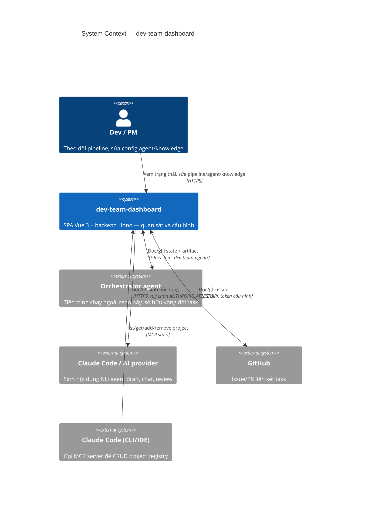

# C4 · Cấp 1 — System Context

← [Danh mục kiến trúc (C4)](../README.md)

`dev-team-dashboard` là SPA quan sát + cấu hình runtime state của một **orchestrator agent chạy ngoài** tiến trình này. Dashboard không sở hữu vòng đời task — nó đọc/ghi vào một thư mục dữ liệu dùng chung với orchestrator, và gọi ra vài dịch vụ ngoài khi người dùng cần.

## Vai trò của từng actor

| Actor | Quan hệ với dashboard | Ghi chú |
|---|---|---|
| **Dev / PM** | Người dùng chính, thao tác qua trình duyệt | Nhiều mode (monitor, editor, agentEditor, …) — chi tiết ở cấp Component |
| **Orchestrator agent** | Ghi `.dev-state/*.json` + artifact khi chạy pipeline; dashboard đọc để hiển thị | Ngoại lệ: pipeline bật `orchestrator.enabled` thì dashboard tự giữ quyền start step (`src/features/orchestrator/`) |
| **Claude Code / AI provider** | Sinh nội dung khi người dùng bấm "generate" (agent draft, NL chat) | Không có `ANTHROPIC_API_KEY` → fallback heuristic, không chặn luồng |
| **GitHub** | Liên kết issue với task, đọc/ghi qua REST API | Token cấu hình per-project trong Settings |
| **Claude Code (CLI/IDE)** | Gọi MCP server (`mcp/server.ts`) để CRUD project registry | Không cần HTTP server chạy — chi tiết ở cấp Container |

Bất biến áp dụng xuyên suốt mọi cấp — xem mục **Bất biến kiến trúc** ở cấp Container ([danh mục](../README.md)).
