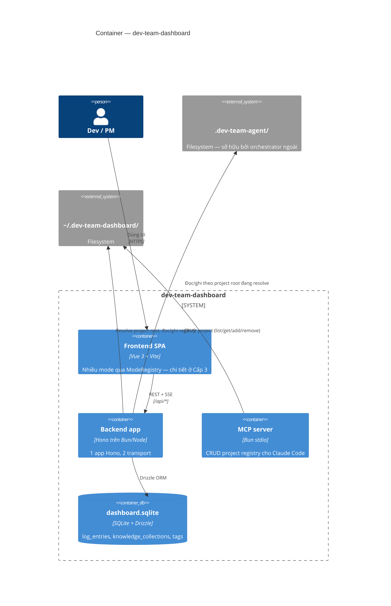

# C4 · Cấp 2 — Container

← [Cấp 1 · Context](../1-context/README.md) · [Cấp 3 · Component](../3-component/README.md)

## 1. Data root `.dev-team-agent/` — container dữ liệu trung tâm

Mọi thao tác đọc/ghi của backend đều **scope vào một thư mục `.dev-team-agent/`** (gọi là "root"). Thư mục này thuộc sở hữu của orchestrator agent **chạy ngoài**, không phải repo này — dashboard chủ yếu quan sát nó. Ngoại lệ duy nhất: pipeline bật **node điều phối** (`orchestrator.enabled`) thì chính dashboard giữ quyền start step của task đó (xem [Cấp 3 · Component](../3-component/README.md) — feature `orchestrator`).

Bên trong root:

- `.dev-state/<task-id>.json` — trạng thái sống của từng task (`current_phase`, `hitl_pending`, `review_round`, `doc_review_round`, …).
- `tasks/<task-id>/*.md` — artifact từng phase: `investigate.md`, `design.md`, `phpstan.md`, `review.md`, `test-spec.md`, `pr-desc.md`, `qa.md`, các sidecar `*-po.md` (doc-review).
- `pipeline.yaml` (global) và `tasks/<id>/pipeline.yaml` (per-task) — override cấu hình pipeline.
- Thư mục cấu hình do dashboard quản lý: `pipeline-profiles/`, `custom-agents/`, `agent-templates/`, `workflow-step-templates/`, `flow-profiles/`.
- `knowledge.config.yaml` + knowledge store (driver `file`): `knowledge/{project,system}/*.md` + sidecar `knowledge/collections.yaml`. Scope `global` **không** nằm ở đây — nó ở `registryHome()/knowledge/global/`, dùng chung mọi project.

### 1.1 Hai run mode resolve root

| Run mode | Cách resolve root | Ghi chú |
|---|---|---|
| **Dev** (`vite.config.ts` → plugin `devTeamApi`) | root = `cwd/..` (dashboard được scaffold vào `.dev-team-agent/viewer/`, nên thư mục cha là data root); override bằng env `DEV_TEAM_ROOT` | Đường single-project cũ. |
| **Standalone / multi-project** (`src/backend/standalone.ts`) | root lấy từ **ProjectRegistry** tại `~/.dev-team-dashboard/projects.json` (override thư mục bằng `DEV_TEAM_DASHBOARD_HOME`); request mang `?project=<id>`; không có id → default project (registry default > env `DEV_TEAM_ROOT` > fallback cũ) | Xem `resolveProjectRoot` trong `src/backend/registry.ts`. |

Đọc/ghi filesystem theo triết lý **defensive** và **path-traversal hardening** — chi tiết ở [Bất biến kiến trúc](#bất-biến-kiến-trúc).

---

## 2. Backend — "một app, nhiều transport"

Backend là **một app Hono duy nhất** chạy trên **hai transport** khác nhau. Toàn bộ logic route viết một lần, cả hai transport cùng thừa hưởng. Tầng HTTP và cách route/business ghép nối thuộc **Cấp 3 · Component** — xem [Cấp 3 · Component §1](../3-component/README.md#1-backend-components).

### 2.1 Shim tương thích

`src/backend/devTeamApi.ts` chỉ là **shim** giữ hợp đồng cũ: re-export `createApiHandler` + export Vite plugin `devTeamApi({root})`. Nó **không** còn chứa logic core.

### 2.2 Hai transport

- **Vite middleware** (`bun run dev`): plugin `devTeamApi({root})` mount handler vào dev server.
- **Node standalone** (`src/backend/standalone.ts`, chạy bằng `bun run serve`, cần `dist/`): HTTP server phục vụ `dist/` (SPA fallback) + mount `createApiHandler`; cổng lấy theo thứ tự ưu tiên env `DEV_TEAM_DASHBOARD_PORT` → `PORT` → mặc định nội bộ. Binds `127.0.0.1` only.

---

## 3. Frontend SPA — container

Vue 3 + Vite, mount 1 app duy nhất qua `ModeRegistry`. Chi tiết component/mode ở [Cấp 3 · Component §2](../3-component/README.md#2-frontend-components). Sơ đồ bootstrap DI/ModeRegistry: [`../../diagram/IoC.md`](../../diagram/IoC.md).

---

## 4. MCP server — container

`mcp/server.ts` (`bun run mcp`) là stdio entrypoint riêng, expose CRUD project-registry (`list_projects`/`get_project`/`add_project`/`remove_project`) cho Claude Code, nói chuyện trực tiếp với `src/backend/registry.ts`. **Không** cần HTTP server chạy. Bật qua `.claude/settings.local.json` (`enabledMcpjsonServers`). Vì dùng chung `src/backend/registry.ts`, project thêm từ Claude Code và từ UI luôn nhất quán.

---

## 5. `dashboard.sqlite` — container DB

File SQLite dùng chung cho mọi subsystem cần lưu trữ có cấu trúc (thay vì file-based) — hiện gồm log driver `sqlite` và knowledge collection/tag. Vị trí: `registryHome()/dashboard.sqlite` — **nằm ngoài cây repo**, cùng chỗ với `projects.json`. Schema, migration — chi tiết ở [Cấp 4 · Code](../4-code/README.md#tầng-db-srcbackenddb).

---

## Bất biến kiến trúc

Thêm scan / endpoint / feature mới không được phá các bất biến sau — áp dụng xuyên suốt mọi cấp:

- **Đọc filesystem phải phòng thủ**: `safeReadDir`/`statSafe` (`fileHelper`) / `readYamlSafe` (`yamlLib`) / `readState`/`loadRegistry` nuốt lỗi, trả empty/false thay vì throw — một file state ghi dở không được làm sập request.
- **Chống path-traversal**: mọi input từ request phải sanitize tại feature sở hữu (`resolveArtifact` + `fileHelper.resolvePathUnder`, `sanitiseProfileName`, `sanitiseAgentName`, `sanitiseSlug`, taskId regex); endpoint ghi file mới phải nghiêm ngặt tương đương. Hàm sanitize domain **không** nằm ở `src/backend` / `src/shared` — gắn vào module business liên quan và export qua `business/index.ts` nếu feature khác cần dùng.
- **Pattern scan tuỳ chỉnh không escape project root**: pattern trong `settings.scanPatterns` bị loại ở `sanitiseScanPattern` (schema dùng chung FE/BE của feature `settings`), lại ở `expandScanPatterns` (bỏ qua mọi symlink), và mỗi match còn qua `resolvePathUnder(projectRoot, …)`.
- **Ghi registry atomic** (temp file + rename trong `saveRegistry`).
- **Fetch URL người dùng** phải qua `fetchUrlSafe` (https-only, chặn private host) — tránh SSRF.
- **Ranh giới scope `src/backend` ⟂ `src/frontend`.** Code frontend **không** import `src/backend/**` hay `node:*` / `bun:*` / `hono` / `drizzle-orm` — kể cả gián tiếp qua một module `business/`. Code backend không import `src/frontend/**` hay `vue`. Thứ dùng thật ở cả hai phía đi vào `src/shared/**`, nơi bị cấm import hạ tầng lẫn hai bucket kia. Cả ba luật do `no-restricted-imports` trong `eslint.config.js` chặn, **không có whitelist** — xem `src/{backend,frontend,shared}/README.md`.
- **ESM thuần**; phía server import module Node bằng dạng `node:`-prefixed.
- **Module `bun:*` không được import tĩnh trên đường nạp `vite.config.ts`.** `bun run build` = `vite build` chạy dưới **Node**, mà Node ESM loader không hiểu scheme `bun:`. `vite.config.ts` kéo `src/backend/apiServer.ts` vào module graph, nên mọi file với tới được từ đó (hiện tại: `src/backend/db/client.ts`) phải nạp `bun:sqlite` và `drizzle-orm/bun-sqlite` bằng `await import(...)`, phần type dùng `import type`. Đổi về import tĩnh là làm đỏ build của **cả repo** — cửa chặn là step `Build` trong CI.
- `ANTHROPIC_API_KEY` tùy chọn, bật NL agent-draft generation (`/api/custom-agents/generate`); không có key thì fallback heuristic.
- `DASHBOARD_SECRET_KEY` **bắt buộc** để dùng credential kiểu "dán secret trực tiếp" (`stored:`) hoặc "Connect via browser"/OAuth (`oauth:`) trong `ConnectionDialog.vue` — mã hoá `secret-vault.json` (`secretVault.ts`). Không set → 2 luồng đó fail rõ ràng, các luồng khác (CLI, `env:`/`file:` secretRef) không bị ảnh hưởng.
