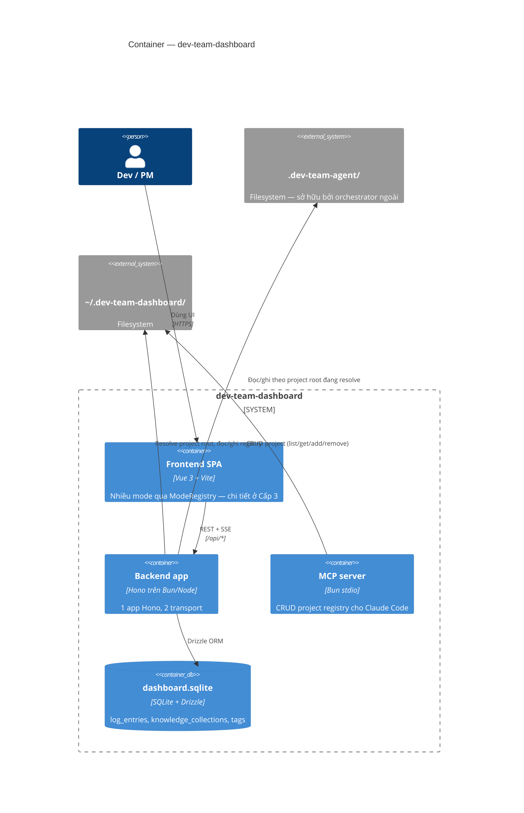

# C4 · Cấp 2 — Container

← [Danh mục kiến trúc (C4)](../README.md)

## 1. Data root `.dev-team-agent/` — container dữ liệu trung tâm

Mọi thao tác đọc/ghi của backend đều **scope vào một thư mục `.dev-team-agent/`** (gọi là "root"). Thư mục này thuộc sở hữu của orchestrator agent **chạy ngoài**, không phải repo này — dashboard chủ yếu quan sát nó. Ngoại lệ duy nhất: pipeline bật **node điều phối** (`orchestrator.enabled`) thì chính dashboard giữ quyền start step của task đó (chi tiết ở cấp Component — feature `orchestrator`).

Root gồm 4 nhóm nội dung: **trạng thái task** đang chạy, **artifact** sinh ra theo từng phase, **config pipeline/agent** override theo tầng, và **knowledge store**. Schema/tên file cụ thể của từng nhóm — xem cấp Code.

### 1.1 Hai run mode resolve root

| Run mode | Cách resolve root |
|---|---|
| **Dev** | root = thư mục cha của thư mục làm việc (dashboard được scaffold vào trong data root); override bằng env `DEV_TEAM_ROOT`. |
| **Standalone / multi-project** | root lấy từ **ProjectRegistry** (override thư mục bằng `DEV_TEAM_DASHBOARD_HOME`); request mang `?project=<id>`; không có id → theo thứ tự ưu tiên registry default → env `DEV_TEAM_ROOT` → fallback nội bộ. |

Đọc/ghi filesystem theo triết lý **defensive** và **path-traversal hardening** — chi tiết ở cấp Code (mục Bất biến kiến trúc).

---

## 2. Backend — "một app, nhiều transport"

Backend là **một app Hono duy nhất** chạy trên **hai transport** khác nhau. Toàn bộ logic route viết một lần, cả hai transport cùng thừa hưởng. Tầng HTTP và cách route/business ghép nối thuộc cấp Component.

### 2.1 Shim tương thích

Transport Vite dev đi qua 1 **shim** mỏng giữ hợp đồng cũ — bản thân shim không chứa logic core, chỉ nối vào app Hono dùng chung. Tên file/export cụ thể — xem cấp Code.

### 2.2 Hai transport

- **Vite middleware** (`bun run dev`): mount handler dùng chung vào dev server.
- **Node standalone** (`src/backend/standalone.ts`, chạy bằng `bun run serve`, cần `dist/`): HTTP server phục vụ `dist/` (SPA fallback) + mount cùng handler; cổng lấy theo thứ tự ưu tiên env `DEV_TEAM_DASHBOARD_PORT` → `PORT` → mặc định nội bộ. Binds `127.0.0.1` only.

---

## 3. Frontend SPA — container

Vue 3 + Vite, mount 1 app duy nhất qua `ModeRegistry`. Chi tiết component/mode + sơ đồ bootstrap DI/ModeRegistry ở cấp Component.

---

## 4. MCP server — container

`mcp/server.ts` (`bun run mcp`) là stdio entrypoint riêng, expose CRUD project-registry (`list_projects`/`get_project`/`add_project`/`remove_project`) cho Claude Code. **Không** cần HTTP server chạy. Vì dùng chung nguồn registry với backend, project thêm từ Claude Code và từ UI luôn nhất quán. Cách bật cụ thể — xem cấp Code.

---

## 5. `dashboard.sqlite` — container DB

File SQLite dùng chung cho mọi subsystem cần lưu trữ có cấu trúc (thay vì file-based) — hiện gồm log driver `sqlite` và knowledge collection/tag. Vị trí: `registryHome()/dashboard.sqlite` — **nằm ngoài cây repo**, cùng chỗ với `projects.json`. Schema, migration — chi tiết ở cấp Code.
