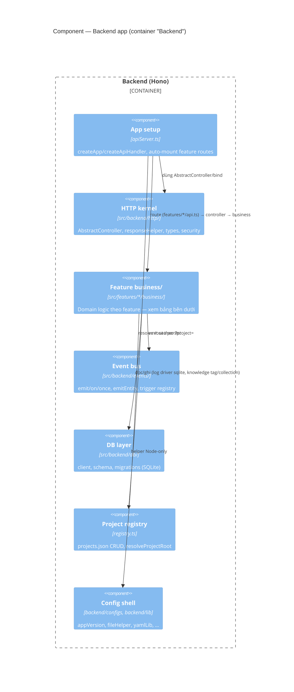

# C4 · Cấp 3 — Component

← [Cấp 2 · Container](../2-container/README.md) · [Cấp 4 · Code](../4-code/README.md)

## 1. Backend components

### 1.1 Tầng HTTP (Hono)

- `src/backend/apiServer.ts` — `createApp(ctx)` dựng Hono + middleware resolve root từ `?project=` / tự duyệt `features/<name>/api.ts` (`registerFeatureRoutes`); `createApiHandler(ctx)` là **cầu nối Node ⇆ Hono** (lazy-await `createApp`).
- `src/backend/http/AbstractController.ts` — base controller (json/ok/requireRoot/parseBody/…) + `bind(Controller, method)`.
- `src/backend/business/AbstractBusiness.ts` — base tầng domain (requireRoot/fail; không biết HTTP).
- `src/features/<name>/controller.ts` — HTTP handler (extends AbstractController); gọi `XxxBusiness`.
- `src/features/<name>/business/` — domain + class `XxxBusiness` (extends AbstractBusiness).
- `src/features/<name>/api.ts` — **chỉ** map route → `bind(...)` + `routeOrder` / `registerRoutes`. Feature mới có `api.ts` thì được nạp (không sửa registry tay).
- `src/backend/http/{responseHelper,types}.ts` — helper response (Node `json` + Hono `j`) + type tầng HTTP. FE fetch client **không** ở đây: `src/frontend/http/client.ts` (§2).

> **Lưu ý routing:** **mọi** route `/api/*` đều đi qua Hono — không feature nào còn nhánh node-res chặn trước. `createApiHandler` là **điểm chốt duy nhất** ghi request log (fire-and-forget trong `finally`, không await vào response).

### 1.2 Domain / business — bảng theo feature

Domain nằm trong `src/features/<name>/business/`. Coupling xuống: `backend/configs` + `backend/lib` + `shared/lib` → business → controller → `src/backend` (Hono setup). Registry ở `src/backend/registry.ts`; entry `src/backend/standalone.ts`. Trong feature, `business/` gom theo **nghiệp vụ đang xử lý cái gì** — tránh tách nhiều file theo loại thao tác kỹ thuật.

| Module | Đường dẫn thật | Vai trò |
|---|---|---|
| Types | `src/backend/http/types.ts` | Nguồn type thống nhất (`HonoEnv`, registry types). |
| Registry | `src/backend/registry.ts` | `projects.json`; REST + MCP. |
| Settings | `src/features/settings/business/` | Autoscan, fs browse, github tokens config, scan patterns. |
| Pipeline | `src/features/pipeline-editor/business/pipeline/` | Layered pipeline config + merge (một module). |
| Catalog / Rules | `src/features/pipeline-editor/business/{catalog,rules}/` | Catalog skills/agents (+ scan); rule project. Nguồn mặc định theo convention, cộng thêm path khớp `settings.scanPatterns`. |
| Agents | `src/features/agent-editor/business/` | `agents.ts` (CRUD/template/fetch) + NL generate. |
| Tasks / artifacts | `src/features/monitor/business/` | Tasks, artifact actions, github issue, task chat. |
| Knowledge | `src/features/knowledge/business/` | File driver đa root cho **entry**; **collection + metadata tag + alias tag** ở `dashboard.sqlite`. Chi tiết DB: [Cấp 4 · Code](../4-code/README.md#tầng-db-srcbackenddb). |
| Logging | `src/backend/log/` (ghi + driver) + `src/features/logs/` (đọc UI, job log stream) | Request/audit/events/usage — hai backend `file`/`sqlite`, chọn bằng `logging.driver`. |
| DB (SQLite) | `src/backend/db/` | Connection dùng chung `dashboard.sqlite` + schema Drizzle + migration. |
| Statistics | `src/features/statistics/business/` | Aggregation token usage từ `usage.jsonl` (`GET /api/statistics/usage`). Giới hạn: [Cấp 4 · Code](../4-code/README.md#tầng-db-srcbackenddb). |
| Runners | `src/features/runner/business/` | Job queue (+ reaper), connections, session ledger (+ capture), providers CLI. |
| Orchestrator | `src/features/orchestrator/business/` | **Opt-in** (`pipeline.orchestrator.enabled`). Subscriber wildcard trên event bus quyết định step nào start/resume/dừng; `brief.ts` cấp bối cảnh, `decision.ts` đọc quyết định qua sentinel `ORCHESTRATOR_DECISION:`. Quyền start ở `monitor/business/tasks/startAuthority.ts`. Tắt ⇒ không đổi hành vi. |
| Automations | `src/features/automations/business/` | Rule CRUD, scheduler tick, event trigger, action `runTask` chạy nền + biến `{{trigger.*}}`/`{{steps.N.*}}`, run ledger ở `registryHome()/automations/`. |
| NL chat | `src/features/nl-chat/business/` | Session builder chat (prompt + parse trong cùng module). |
| CLI | `src/backend/runner-cli.mjs` | Runner CLI entry. |

### 1.3 Event bus (kernel)

Event bus nội bộ tại `src/backend/events/` (`emit` / `on` / `once`, `emitEntity` cho CRUD `entity.*`, trigger registry). Nguyên tắc: **persist rồi mới emit** (`saveJob` / `writeStateAtomic` / `saveRegistry` → `emit`); handler lỗi bị nuốt + `console.warn`. Runtime trigger (schedule tick + event subscriber) do feature **automations** wire — rule đang bật được đồng bộ vào trigger registry qua `syncTriggerRegistry`. Mục lục event theo feature: [`../../event-catalog.md`](../../event-catalog.md).

### 1.4 Config shell backend

`src/backend/configs/` (đọc `package.json`, …) + `src/backend/lib/` (helper Node-only: `fileHelper`, `processHelper`, `yamlLib`, `dirModuleLoader`, `arrayUtils`, `dateUtils`). Không import HTTP kernel; domain/business import khi cần. Chi tiết từng file: [Cấp 4 · Code](../4-code/README.md#config-shell).

---

## 2. Frontend components

`src/frontend/main.ts` mount `src/frontend/App.vue`. `App.vue` là shell mỏng: `inject` 1 service container (`src/frontend/container/`, DI/IoC trên native Vue `provide/inject`) → `resolve` `ModeRegistry` (`src/frontend/shell/modeRegistry.ts`) → lặp `listModes()` để render sidebar nav / status text / main panel. `App.vue` **không** hard-code danh sách mode — mỗi feature tự đăng ký qua `src/features/<feature>/registerMode.ts`, `main.ts` tự quét bằng `import.meta.glob('../features/*/registerMode.ts', { eager: true })`. Sơ đồ bootstrap + diễn giải: [`../../diagram/IoC.md`](../../diagram/IoC.md). Mode `monitor` nhận task-list qua SSE `GET /api/tasks/stream` (`src/features/monitor/composables/useTaskPolling.ts`, fetch-based reader ở `src/frontend/lib/sseClient.ts`); kết nối giữ xuyên suốt mọi mode.

### 2.1 Bảng mode (`ModeEntry.key`)

| Mode | Thư mục | Component / thành phần chính |
|---|---|---|
| `monitor` | `src/features/monitor/` | `MonitorLayout`, `TaskList`, `PipelineView`, `PipelineNode`, `QaPanel`, `ArtifactPanel`, `ProjectBar`, `SectionSaveIndicator`; composables `useTaskPolling.ts`, `useInlineMarkdownEdit.ts` |
| `editor` (Pipeline Editor) | `src/features/pipeline-editor/` | `PipelineEditor`, `PipelineEditorNode`, `StepConfigDialog`, `CatalogPanel`, `RulesPanel`, `ProfileManager`; `lib/pipelineRoundTrip.ts` |
| `agentEditor` | `src/features/agent-editor/` | `AgentEditor`, `AgentSectionEditor`, `WorkflowSectionEditor`, `AgentTemplatePicker`, `AgentNlWizard` |
| `quickAction` | `src/features/quick-action/` | `QuickActionPanel` — chạy nhanh 1 action (agent/runner) trên artifact/task đang chọn |
| `knowledge` | `src/features/knowledge/` | `KnowledgePanel` |
| `runner` | `src/features/runner/` | `RunnerConfigPanel`, `ConnectionDialog` |
| `automations` | `src/features/automations/` | `AutomationsPanel`, `AutomationFormDialog`; composable `useAutomations.ts` — rule đa trigger → chuỗi action `runTask`; chat NL tạo automation qua entity `'automation'` |
| `logs` (Nhật ký) | `src/features/logs/` | `LogsPanel`, `TaskTimeline`; composable `useTaskTimeline.ts` |
| `statistics` (Thống kê) | `src/features/statistics/` | `StatisticsPanel`, `ChartCard` (mermaid P0); `lib/mermaidChart.ts`; drill-down project → task → step → job |

- `src/features/notifications/` — không phải mode, mount xuyên suốt mọi mode trong `App.vue` (bell `sidebar-footer` và/hoặc `FloatingNotificationIcon`, chọn qua Settings › Thông báo › Vị trí hiển thị). Badge HITL-pending/QA-ready **client-only**, suy từ `tasks` ref nhận qua SSE (diff `hitl_pending`/`has_qa`) — không có endpoint/schema backend riêng. Composable `useNotifications.ts` đọc `src/frontend/configs/appSettings.ts` để bật/tắt notify, browser `Notification` API, âm thanh Web Audio API. Component dropdown dùng chung `components/NotificationList.vue`.

### 2.2 API layer

- **Server setup** (`src/backend/`): `apiServer.ts` + `devTeamApi.ts` — xem [Cấp 2 · Container](../2-container/README.md#2-backend---một-app-nhiều-transport).
- **FE fetch**: `src/frontend/http/client.ts` (`apiGet`/`apiPost`/…). Fetch theo consumer ở `src/features/<mode>/scripts/`. Hono route đăng ký ở `features/*/api.ts`.
- Suy diễn trạng thái phase (`PHASES`, `phasesFromPipeline`, `phaseStatus`) nằm ở `src/shared/lib/phase.ts`. Phase status **được suy từ sự tồn tại của artifact** + con trỏ live — phản chiếu đúng quy tắc của orchestrator.

### 2.3 Nền frontend + config shell

Nền tảng FE/shell: `composables/*`, `lib/` (helper thuần browser), `ui/`, `shell/keys.ts`, `container/`, `http/client.ts`, `configs/` (preference shell). Suy diễn phase + helper chuỗi dùng chung ở `src/shared/lib/`. Schema domain ở `features/<name>/schemas/`. i18n cài qua `src/frontend/plugins` (`installPlugins`); message theo `features/<name>/locales/` + `plugins/i18n/locales/common/`. Chi tiết từng file config shell (FE + BE + shared): [Cấp 4 · Code](../4-code/README.md#config-shell).

Styling (SCSS entry, tự nạp theo feature): [Cấp 4 · Code](../4-code/README.md#styling).
