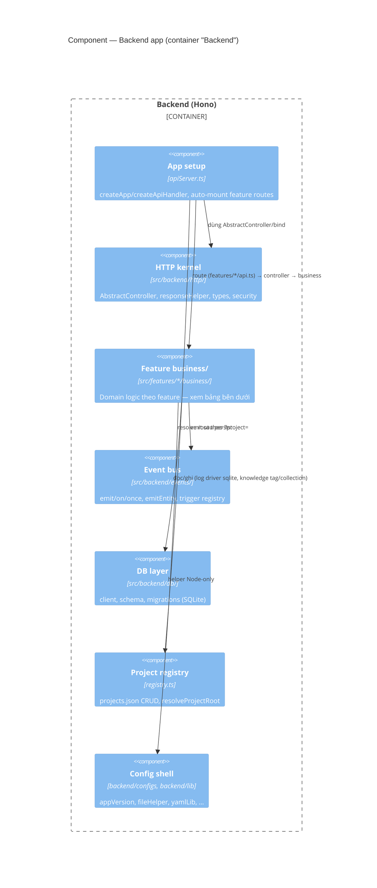

# C4 · Cấp 3 — Component

← [Danh mục kiến trúc (C4)](../README.md)

## 1. Backend components

### 1.1 Tầng HTTP (Hono)

- `src/backend/apiServer.ts` — `createApp(ctx)` dựng Hono + middleware resolve root từ `?project=` / tự duyệt `features/<name>/api.ts` (`registerFeatureRoutes`); `createApiHandler(ctx)` là **cầu nối Node ⇆ Hono** (lazy-await `createApp`).
- `src/backend/http/AbstractController.ts` — base controller (json/ok/requireRoot/parseBody/…) + `bind(Controller, method)`.
- `src/backend/business/AbstractBusiness.ts` — base tầng domain (requireRoot/fail; không biết HTTP).
- `src/features/<name>/controller.ts` — HTTP handler (extends AbstractController); gọi `XxxBusiness`.
- `src/features/<name>/business/` — domain + class `XxxBusiness` (extends AbstractBusiness).
- `src/features/<name>/api.ts` — **chỉ** map route → `bind(...)` + `routeOrder` / `registerRoutes`. Feature mới có `api.ts` thì được nạp (không sửa registry tay).
- `src/backend/http/{responseHelper,types}.ts` — helper response (Node `json` + Hono `j`) + type tầng HTTP. FE fetch client **không** ở đây: `src/frontend/http/client.ts` (§2).

> **Lưu ý routing:** **mọi** route `/api/*` đều đi qua Hono — không feature nào còn nhánh node-res chặn trước. `createApiHandler` là **điểm chốt duy nhất** ghi request log (fire-and-forget trong `finally`, không await vào response).

### 1.2 Domain / business — theo feature

Domain nằm trong `src/features/<name>/business/`. Coupling xuống: `backend/configs` + `backend/lib` + `shared/lib` → business → controller → `src/backend` (Hono setup). Trong feature, `business/` gom theo **nghiệp vụ đang xử lý cái gì** — tránh tách nhiều file theo loại thao tác kỹ thuật. Danh sách feature cụ thể xem trực tiếp `src/features/` (đổi thường xuyên hơn kiến trúc, không lặp lại ở đây). Vài nhóm có hành vi **không hiển nhiên từ tên thư mục**, đáng ghi lại:

- **Registry** (`src/backend/registry.ts`) — nguồn sự thật cho project registry, dùng chung bởi REST và MCP server.
- **Pipeline / Catalog / Rules** (feature pipeline-editor) — pipeline config layered + merge; catalog agent/skill và rule project đọc theo convention, cộng thêm path khớp `settings.scanPatterns`.
- **Knowledge** — entry lưu qua file driver đa root; **collection + tag** lưu ở `dashboard.sqlite` (khác driver với entry). Chi tiết ở cấp Code.
- **Logging** — hai driver `file` / `sqlite`, chọn qua `logging.driver`.
- **Statistics** — aggregation từ log usage; có giới hạn khi driver log là `sqlite` — chi tiết ở cấp Code.
- **Orchestrator** — **opt-in** qua `pipeline.orchestrator.enabled`; subscriber trên event bus quyết định step start/resume/dừng thay vì chuỗi tự nối cũ; quyền start step do feature Tasks (monitor) sở hữu. Tắt ⇒ không đổi hành vi.
- **Automations** — rule đa trigger (timer/event) → chuỗi action chạy nền, biến tham chiếu output bước trước, có run ledger riêng ở data root.

### 1.3 Event bus (kernel)

Event bus nội bộ tại `src/backend/events/` (`emit` / `on` / `once`, `emitEntity` cho CRUD `entity.*`, trigger registry). Nguyên tắc: **persist rồi mới emit** (`saveJob` / `writeStateAtomic` / `saveRegistry` → `emit`); handler lỗi bị nuốt + `console.warn`. Runtime trigger (schedule tick + event subscriber) do feature **automations** wire — rule đang bật được đồng bộ vào trigger registry qua `syncTriggerRegistry`. Mục lục event theo feature — xem cấp Code.

### 1.4 Config shell backend

`src/backend/configs/` (đọc `package.json`, …) + `src/backend/lib/` (helper Node-only: `fileHelper`, `processHelper`, `yamlLib`, `dirModuleLoader`, `arrayUtils`, `dateUtils`). Không import HTTP kernel; domain/business import khi cần. Chi tiết từng file ở cấp Code.

---

## 2. Frontend components

`src/frontend/main.ts` mount `src/frontend/App.vue`. `App.vue` là shell mỏng: `inject` 1 service container (`src/frontend/container/`, DI/IoC trên native Vue `provide/inject`) → `resolve` `ModeRegistry` (`src/frontend/shell/modeRegistry.ts`) → lặp `listModes()` để render sidebar nav / status text / main panel. `App.vue` **không** hard-code danh sách mode — mỗi feature tự đăng ký qua `src/features/<feature>/registerMode.ts`, `main.ts` tự quét bằng `import.meta.glob('../features/*/registerMode.ts', { eager: true })`. Sơ đồ bootstrap + diễn giải: [`ioc-bootstrap-runtime.md`](ioc-bootstrap-runtime.md). Mode `monitor` nhận task-list qua SSE `GET /api/tasks/stream` (`src/features/monitor/composables/useTaskPolling.ts`, fetch-based reader ở `src/frontend/lib/sseClient.ts`); kết nối giữ xuyên suốt mọi mode.

### 2.1 Mode (`ModeEntry.key`)

Mỗi feature đăng ký 1 mode qua `registerMode.ts` — danh sách mode + component cụ thể đổi theo tính năng, xem trực tiếp `src/features/<feature>/` thay vì liệt kê ở đây. Vài mode có hành vi khác biệt đáng ghi lại:

- `monitor` — mode duy nhất giữ kết nối SSE theo dõi liên tục (§2 trên); mọi mode khác chỉ lấy dữ liệu 1 lần khi vào.
- `automations` — rule đa trigger (timer/event) → chuỗi action; chat NL tạo automation dùng chung cơ chế NL chat.
- `statistics` — chart render qua mermaid, drill-down project → task → step → job.

`src/features/notifications/` — không phải mode, mount xuyên suốt mọi mode trong `App.vue` (vị trí hiển thị chọn qua Settings › Thông báo). Badge HITL-pending/QA-ready **client-only**, suy từ dữ liệu task nhận qua SSE (diff giữa các lần cập nhật) — không có endpoint/schema backend riêng.

### 2.2 API layer

- **Server setup** (`src/backend/`): `apiServer.ts` + `devTeamApi.ts` — xem cấp Container.
- **FE fetch**: `src/frontend/http/client.ts` (`apiGet`/`apiPost`/…). Fetch theo consumer ở `src/features/<mode>/scripts/`. Hono route đăng ký ở `features/*/api.ts`.
- Suy diễn trạng thái phase (`PHASES`, `phasesFromPipeline`, `phaseStatus`) nằm ở `src/shared/lib/phase.ts`. Phase status **được suy từ sự tồn tại của artifact** + con trỏ live — phản chiếu đúng quy tắc của orchestrator.

### 2.3 Nền frontend + config shell

Nền tảng FE/shell: `composables/*`, `lib/` (helper thuần browser), `ui/`, `shell/keys.ts`, `container/`, `http/client.ts`, `configs/` (preference shell). Suy diễn phase + helper chuỗi dùng chung ở `src/shared/lib/`. Schema domain ở `features/<name>/schemas/`. i18n cài qua `src/frontend/plugins` (`installPlugins`); message theo `features/<name>/locales/` + `plugins/i18n/locales/common/`. Chi tiết từng file config shell (FE + BE + shared) và styling (SCSS entry, tự nạp theo feature) ở cấp Code.
