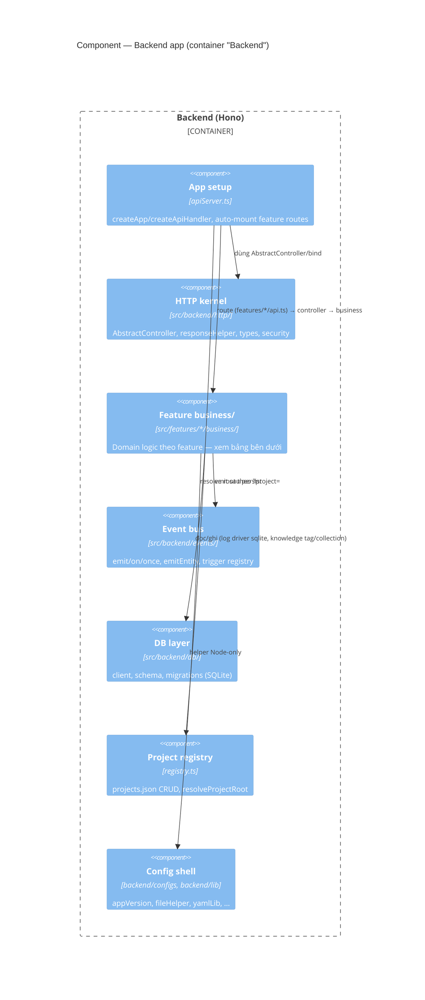

# C4 · Cấp 3 — Component

← [Danh mục kiến trúc (C4)](../README.md)

## 1. Backend components

### 1.1 Tầng HTTP (Hono)

Component trung gian giữa route và business, dùng chung 1 pattern cho **mọi** feature: route khai trong `api.ts`, HTTP handler trong `controller.ts`, domain logic trong `business/`. Feature mới thêm `api.ts` thì tự được nạp — không sửa registry tay. **Mọi** route `/api/*` đều đi qua Hono, không feature nào còn nhánh chặn trước; điểm chốt ghi request log cũng nằm ở đây, không rải rác theo feature. FE fetch client là component riêng, không nằm trong tầng này (§2.2).

Tên class/hàm cụ thể hiện thực pattern trên (`AbstractController`, `AbstractBusiness`, `createApiHandler`, …) — xem cấp Code.

### 1.2 Domain / business — theo feature

Domain nằm trong `src/features/<name>/business/`. Coupling xuống: `backend/configs` + `backend/lib` + `shared/lib` → business → controller → `src/backend` (Hono setup). Trong feature, `business/` gom theo **nghiệp vụ đang xử lý cái gì** — tránh tách nhiều file theo loại thao tác kỹ thuật. Danh sách feature cụ thể xem trực tiếp `src/features/` (đổi thường xuyên hơn kiến trúc, không lặp lại ở đây). Vài nhóm có hành vi **không hiển nhiên từ tên thư mục**, đáng ghi lại:

- **Registry** (`src/backend/registry.ts`) — nguồn sự thật cho project registry, dùng chung bởi REST và MCP server.
- **Pipeline / Catalog / Rules** (feature pipeline-editor) — pipeline config layered + merge; catalog agent/skill và rule project đọc theo convention, cộng thêm path khớp `settings.scanPatterns`.
- **Knowledge** — entry lưu qua file driver đa root; **collection + tag** lưu ở `dashboard.sqlite` (khác driver với entry). Chi tiết ở cấp Code.
- **Logging** — hai driver `file` / `sqlite`, chọn qua `logging.driver`.
- **Statistics** — aggregation từ log usage; có giới hạn khi driver log là `sqlite` — chi tiết ở cấp Code.
- **Orchestrator** — **opt-in** qua `pipeline.orchestrator.enabled`; subscriber trên event bus quyết định step start/resume/dừng thay vì chuỗi tự nối cũ; quyền start step do feature Tasks (monitor) sở hữu. Tắt ⇒ không đổi hành vi.
- **Automations** — rule đa trigger (timer/event) → chuỗi action chạy nền, biến tham chiếu output bước trước, có run ledger riêng ở data root.

### 1.3 Event bus (kernel)

Event bus nội bộ giữ nguyên tắc **persist rồi mới emit** — không feature nào được emit trước khi ghi xong; lỗi trong handler không làm sập luồng chính đang emit. Runtime trigger (schedule tick + event subscriber) do feature **automations** sở hữu: rule đang bật tự động đồng bộ vào trigger registry, feature khác không tự đăng ký tay. Mục lục event theo feature + API/hàm cụ thể — xem cấp Code.

### 1.4 Config shell backend

Preference/version shell + helper Node-only tách riêng khỏi domain — không import HTTP kernel; domain/business import khi cần. Danh sách file cụ thể — xem cấp Code.

---

## 2. Frontend components

`App.vue` là shell mỏng: dùng 1 service container (DI/IoC trên native Vue `provide`/`inject`) để lấy `ModeRegistry`, lặp danh sách mode để render sidebar/status/main panel. `App.vue` **không** hard-code danh sách mode — mỗi feature tự đăng ký, quét tự động lúc khởi động. Sơ đồ bootstrap + diễn giải: [`ioc-bootstrap-runtime.md`](ioc-bootstrap-runtime.md); tên file/API cụ thể — xem cấp Code.

### 2.1 Mode (`ModeEntry.key`)

Mỗi feature đăng ký 1 mode qua `registerMode.ts` — danh sách mode + component cụ thể đổi theo tính năng, xem trực tiếp `src/features/<feature>/` thay vì liệt kê ở đây. Vài mode có hành vi khác biệt đáng ghi lại:

- `monitor` — mode duy nhất giữ 1 kết nối SSE theo dõi liên tục (task-list), xuyên suốt mọi mode; mọi mode khác chỉ lấy dữ liệu 1 lần khi vào.
- `automations` — rule đa trigger (timer/event) → chuỗi action; chat NL tạo automation dùng chung cơ chế NL chat.
- `statistics` — chart render qua mermaid, drill-down project → task → step → job.

`src/features/notifications/` — không phải mode, mount xuyên suốt mọi mode trong `App.vue` (vị trí hiển thị chọn qua Settings › Thông báo). Badge HITL-pending/QA-ready **client-only**, suy từ dữ liệu task nhận qua SSE (diff giữa các lần cập nhật) — không có endpoint/schema backend riêng.

### 2.2 API layer

- **Server setup**: xem cấp Container.
- **FE fetch**: 1 client dùng chung cho mọi feature, gọi theo consumer ở từng mode; route phía server đăng ký đồng nhất theo pattern `api.ts` (§1.1).
- Trạng thái phase **được suy từ sự tồn tại của artifact** + con trỏ live, không bao giờ encode trực tiếp — phản chiếu đúng quy tắc của orchestrator. Tên hàm/file cụ thể — xem cấp Code.

### 2.3 Nền frontend + config shell

Nền tảng FE/shell (composables, helper thuần browser, UI kit, preference shell) tách khỏi domain feature — domain import nền, nền không phụ thuộc ngược lại feature nào, cùng nguyên tắc với backend (§1.4). Schema domain khai trong từng feature, không đặt ở nền chung. i18n cài đặt tập trung 1 chỗ duy nhất, feature chỉ khai message theo namespace của mình. Danh sách file cụ thể (FE + BE + shared), cấu trúc plugin i18n, và styling — xem cấp Code.
