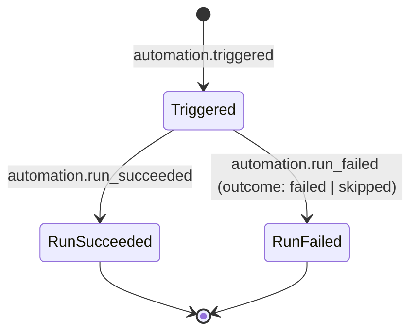
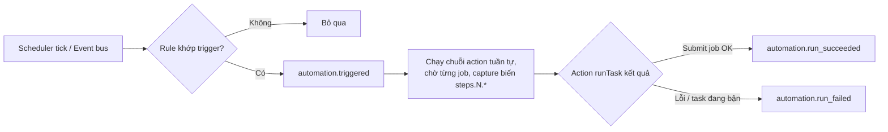

# Events — Automations (rule lifecycle & run)

← [`README.md`](README.md)

Xem thêm #233.

## State chart — 1 lượt chạy rule

## Flow chart — trigger đến kết quả

Trigger `kind: event` subscribe wildcard trên bus nhưng **bỏ qua** `automation.*` (chống vòng lặp rule → run → event → rule); chỉ khớp khi `payload.projectId` bằng project của rule.

## Event

| Event | Khi nào | Payload gợi ý | Nơi emit |
|-------|---------|---------------|----------|
| `automation.triggered` | Rule khớp trigger (tick scheduler / event / Run now) — trước khi action chạy | `automationId`, `projectId`, `runId`, `triggerKind`, `source` (`manual`/`schedule`/`event`) | `automations/business/runAction.ts` |
| `automation.run_succeeded` | Action `runTask` xong (job đã submit) | `automationId`, `projectId`, `runId`, `taskId?`, `jobId?` | `runAction.ts` |
| `automation.run_failed` | Action lỗi hoặc bị skip (task đang bận) | `automationId`, `projectId`, `runId`, `outcome` (`failed`/`skipped`), `error?`, `taskId?` | `runAction.ts` |
| `entity.created\|updated\|deleted` (`entity: automation`) | CRUD rule | `id`, `projectId` (+`detail.enabled` khi toggle) | `automations/controller.ts` |
| `entity.created\|updated\|deleted` (`entity: knowledge`) | CRUD entry knowledge (kể cả upload và mỗi entry bị `renameTag` chạm) | `id` (`<scope>/<slug>`), `projectId`, `detail.scope` (không có khi xoá / rename tag) | `knowledge/controller.ts` |
| `entity.created\|updated\|deleted` (`entity: knowledge-collection`) | CRUD collection trong bảng `knowledge_collections` (`dashboard.sqlite`) | `id`, `projectId`, `detail.scope` (không có khi xoá) | `knowledge/controller.ts` |
| `entity.created\|updated` (`entity: knowledge-tag`) | Tạo/sửa **metadata** tag (màu, mô tả) trong bảng `knowledge_tags`. 🚫 Không có `deleted`: xoá tag đi đường `POST /tags/rename` với `to` rỗng và phát `entity: knowledge` cho từng entry bị chạm | `id` (tên tag), `projectId`, `detail.scope` | `knowledge/controller.ts` |

⚠️ **Payload knowledge cố ý tối thiểu** — không kèm nội dung entry: tài liệu nội bộ có thể rất dài và event đi thẳng vào `events.jsonl`.

Ghi chú:

- Rule có **nhiều trigger** (OR): timer (once/interval/cron cùng mốc `startAt`) do scheduler tick đánh giá; trigger `kind: event` — xem flow chart trên.
- Run là **chuỗi action tuần tự chạy nền** (chờ từng job xong, capture stdout/artifacts làm biến `{{steps.N.*}}` cho bước sau — `lib/vars.ts`); event `run_succeeded`/`run_failed` phát khi cả chuỗi kết thúc.
- Runtime state + run history: `registryHome()/automations/<projectKey>/` (`state.json` + `runs/`); config rule ở data root `automations/<id>.yaml`.
- Trigger registry (`registerTrigger`/`listTriggers`) được đồng bộ từ rule đang bật qua `syncTriggerRegistry` — runtime thật là scheduler tick + event subscriber của feature.
