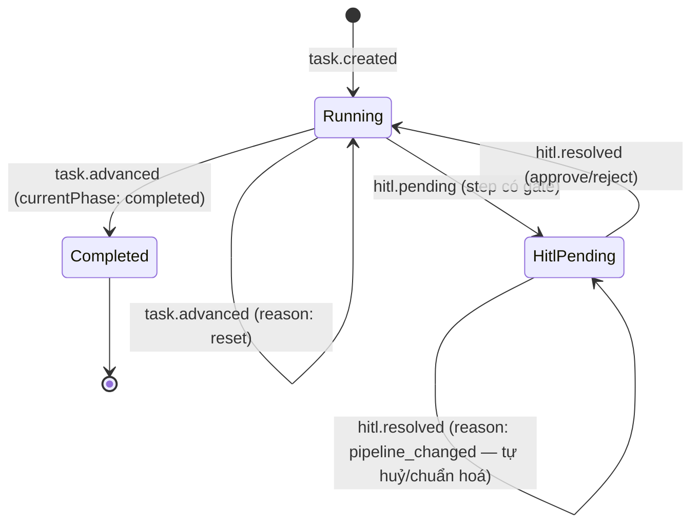
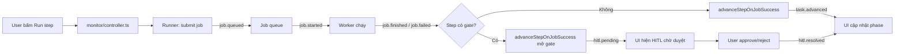

# Events — Monitor (task, HITL, project)

← [`README.md`](README.md)

## State chart — vòng đời task

Minh hoạ, không phải enum cứng: `currentPhase` là step thật của pipeline (khác nhau theo cấu hình), không phải 1 tập giá trị cố định.

## Flow chart — chạy 1 step

## Event — task & HITL

| Event | Khi nào | Payload gợi ý | Nơi emit |
|-------|---------|---------------|----------|
| `task.created` | Tạo task (dialog / chat NL) | `taskId`, `projectId` | `monitor/controller.ts` `createTask` |
| `task.advanced` | Đổi `current_phase` sau job success (không gate), `review_retry`, hoặc reset step (nút reset) | `taskId`, `stepId`, `currentPhase`, `devTeamRoot`, đôi khi `reason` (+ `resetScope`, `deleteScope`, `removedSteps` khi `reason: reset`) | `monitor/business/tasks/state.ts` `advanceStepOnJobSuccess` / `resetPipelineStepAssumingLock` |
| `hitl.pending` | Step có `hitl.gate_id` — mở cổng chờ duyệt | `taskId`, `gateId`, `stepId`, `devTeamRoot` | `state.ts` `advanceStepOnJobSuccess` |
| `hitl.resolved` | Approve / reject HITL | `taskId`, `gateId`, `action`, `currentPhase`, `stepId`, `projectId`, `devTeamRoot` | `state.ts` `applyHitlAction` |
| `hitl.resolved` (`reason: pipeline_changed`) | Pipeline đổi khiến gate đang pending không còn được step hiện tại khai báo — hệ thống tự huỷ (`action: 'cancelled'`) hoặc chuẩn hoá legacy `true` về gate id (`action: 'normalized'`) | `taskId`, `gateId` (giá trị cũ, null nếu legacy `true`), `action`, `reason`, `currentPhase` | `state.ts` `reconcileGateStateAssumingLock` |
| `entity.updated` (`entity: task-state`) | Repair / cập nhật state task | `id`, `projectId`, `detail` | `monitor/controller.ts` |
| `entity.deleted` (`entity: task-state`) | Xóa task | `id`, `projectId` | `monitor/controller.ts` |
| `entity.deleted` (`entity: worktree`) | Dọn git worktree của task từ dashboard | `id` (taskId), `projectId`, `detail` (`path`, `branch`, `prunedOnly`) | `monitor/controller.ts` `deleteTaskWorktree` |

**Pipeline / pipeline step (gián tiếp — không có type riêng):**

| Quan sát | Event liên quan | Ghi chú |
|----------|-----------------|--------|
| Bắt đầu chạy step (`run-step`) | `job.queued` → `job.started` → `job.finished` \| `job.failed` | `metadata` / payload có `taskId`, `pipelineStepId` (vd `investigator`) |
| Step không gate xong | `task.advanced` | `currentPhase` = step kế hoặc `completed` |
| Step có gate xong job | `hitl.pending` | `current_phase` giữ step hiện tại |
| Duyệt / từ chối gate | `hitl.resolved` | Có thể kèm đổi phase |
| Review-retry | `task.advanced` (`reason: review_retry`) | Quay `restart_from` |
| Reset step (nút reset trên `PipelineNode`) | `task.advanced` (`reason: reset`) | Lùi `current_phase` về `stepId`; kèm `resetScope`, `deleteScope`, `removedSteps` |

Không emit `pipeline.created` / `step.started` / `task.reset` trên bus hiện tại — reset tái dùng `task.advanced` như review-retry, không cần type riêng.

## Event — project

| Event | Khi nào | Payload gợi ý | Nơi emit |
|-------|---------|---------------|----------|
| `entity.created` (`entity: project`) | Thêm / clone project | `id`, `projectId` | `monitor/controller.ts` |
| `entity.deleted` (`entity: project`) | Xóa project khỏi registry | `id`, `projectId` | `monitor/controller.ts` |
