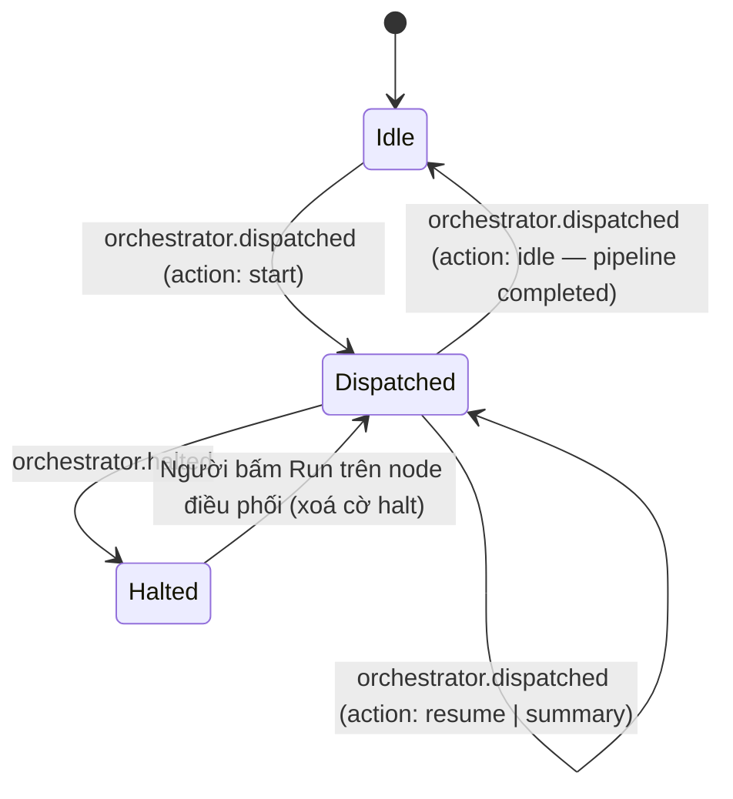
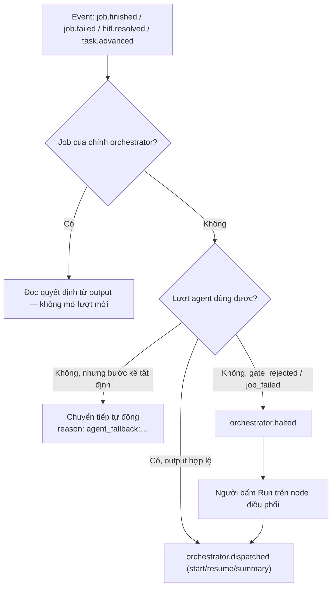

# Events — Orchestrator (node điều phối pipeline)

← [`README.md`](README.md)

Chỉ phát khi pipeline bật `orchestrator.enabled` (checkbox "Có node điều phối" trong pipeline editor). Tắt ⇒ **không** event nào ở nhóm này, và pipeline chạy y như cũ.

## State chart — vòng lặp quyết định

## Flow chart — nhánh quyết định mỗi khi có event hành động

## Event

| Event | Khi nào | Payload | Nơi emit |
|-------|---------|---------|----------|
| `orchestrator.dispatched` | Mỗi quyết định điều phối — kể cả `action: 'summary'` (ghi nhận kết quả, không chạy step) và `action: 'idle'` khi pipeline đã `completed` (mốc kết thúc trong lịch sử) | `taskId`, `projectId`, `devTeamRoot`, `stepId` (không có với `summary`/`idle`), `action` (`start` \| `resume` \| `summary` \| `idle`), `reason` (lượt lưới an toàn mang tiền tố `agent_fallback:`) | `orchestrator/business/decisionLoop.ts` |
| `orchestrator.halted` | Người bấm Stop, agent trả `halt`, output quyết định không hợp lệ, hoặc job của chính orchestrator failed | `taskId`, `projectId`, `devTeamRoot`, `reason` | `decisionLoop.ts` `haltTask` · `monitor/controller.ts` `putTaskOrchestrator` |
| `orchestrator.start_requested` | Automation `mode: existing` trỏ vào task đang được điều phối — bị từ chối (403) và ghi `skipped` thay vì `failed` | `taskId`, `projectId`, `devTeamRoot`, `automationId` | `automations/business/runAction.ts` |

Ghi chú:

- Subscriber của orchestrator **bỏ qua mọi** event `orchestrator.*` (chống vòng lặp dispatch → job → event → dispatch), đúng cách `automations` bỏ qua `automation.*`.
- Nó *nghe* mọi event của task nhưng chỉ **hành động** ở `job.finished` / `job.failed` / `hitl.resolved` / `task.advanced`. `job.finished` của một job **step** là mốc "bước xong" duy nhất mở một lượt agent — lúc đó cursor đã dịch và `stdout`/`artifactsFound` đã được ghi. `task.advanced` chỉ còn nhiệm vụ phát mốc `idle` khi pipeline `completed`; `hitl.pending` cố ý không kích hoạt gì — cổng đang chờ người, không chờ orchestrator (agent vẫn có lượt tóm tắt từ `job.finished` của step chạm cổng).
- `job.finished` của **chính job orchestrator** không mở lượt mới: nhánh đọc quyết định chạy trước tập event hành động, nếu không thì mỗi lượt agent tự sinh lượt kế.
- Halt là **trả quyền chạy tay**, không phải trạng thái lỗi: sau halt thì Run/Reset trên node step hiện lại. Bấm Run trên node điều phối (hoặc lưu lại checkbox) xoá cờ halt và giao lượt mới cho agent.
- Lượt agent không dùng được (output rỗng / JSON hỏng / job của nó failed) **không** dừng pipeline khi bước kế là tất định: orchestrator chuyển tiếp theo thứ tự pipeline và ghi `reason: 'agent_fallback: …'`. Với `gate_rejected` / `job_failed` thì vẫn halt — ở đó không có bước kế nào đúng để đoán.
