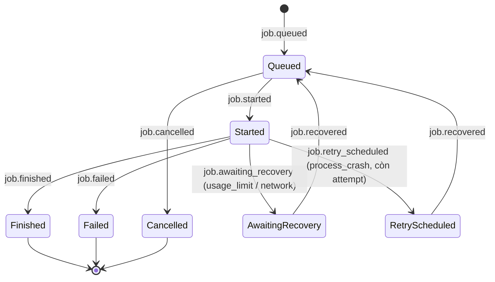
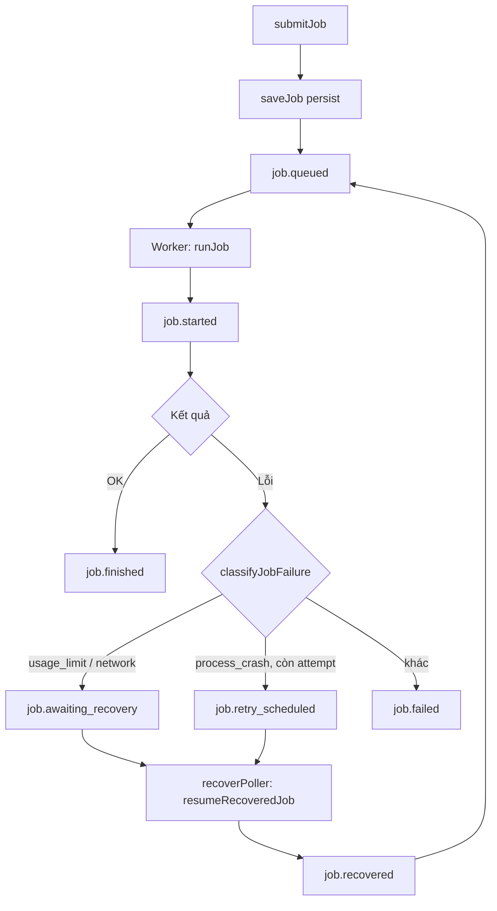

# Events — Runner (job lifecycle, cấu hình)

← [`README.md`](README.md)

## State chart — vòng đời job

## Flow chart — submit đến kết thúc

## Event — job lifecycle

| Event | Khi nào | Payload gợi ý | Nơi emit |
|-------|---------|---------------|----------|
| `job.queued` | `submitJob` sau `saveJob` | `jobId`, `runnerId`, `taskId?`, `projectId?` | `runner/business/jobQueue.ts` |
| `job.started` | Worker bắt đầu chạy | `jobId`, `runnerId`, `providerId`, `taskId?`, `projectId?` | `jobQueue.ts` `runJob` |
| `job.finished` | Kết thúc thành công | `jobId`, `status`, `taskId?`, `projectId?` | `jobQueue.ts` |
| `job.failed` | Lỗi / early-fail (no runner, cred, prompt, …) | `jobId`, `error?`, `taskId?`, `projectId?` | `jobQueue.ts` |
| `job.cancelled` | `cancelJob` sau persist | `jobId`, `taskId?`, `projectId?` | `jobQueue.ts` |
| `job.awaiting_recovery` | Fail do `usage_limit`/`network` (`classifyJobFailure`) — non-terminal, chờ tự resume | `jobId`, `kind`, `resumeAfter`, `taskId?`, `projectId?` | `jobQueue.ts` `runJob` |
| `job.retry_scheduled` | Fail do `process_crash`, còn attempt — tự retry sau backoff | `jobId`, `attemptCount`, `resumeAfter`, `taskId?`, `projectId?` | `jobQueue.ts` `runJob` |
| `job.recovered` | Poller (`recoverPoller.ts`) resume job từ `awaiting_recovery`/backoff về `queued` | `jobId`, `kind`, `taskId?`, `projectId?` | `recoverPoller.ts` `resumeRecoveredJob` |

## Event — CRUD cấu hình

| Event | Entity (`payload.entity`) | Khi nào |
|-------|---------------------------|---------|
| `entity.updated` / `entity.deleted` | `runner` | Upsert / xóa runner |
| `entity.updated` / `entity.deleted` | `connection` | Upsert / xóa connection (chọn provider config + credential riêng, tự chứa providerId/credentialId) |
| `entity.updated` / `entity.deleted` | `provider-config` | Upsert / xóa provider config (interface + baseURL, không còn bao gồm credential) |
| `entity.updated` / `entity.deleted` | `command` | Upsert / xóa command |
| `entity.updated` / `entity.deleted` | `credential` | Upsert / xóa credential profile |

Nơi emit: `runner/controller.ts` (sau mutation OK).
