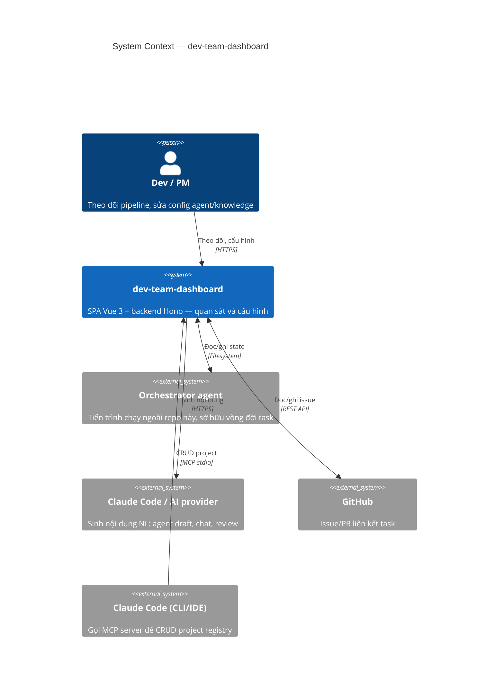
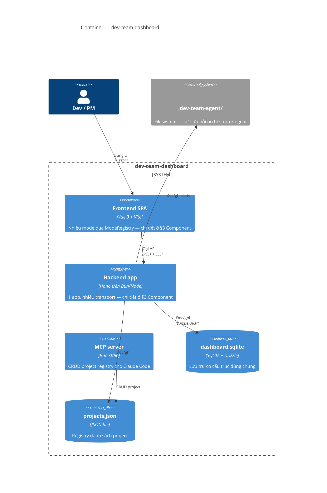
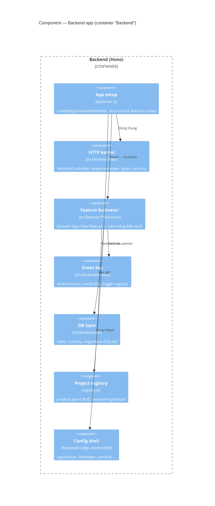

# Kiến trúc — danh mục C4

> **Tóm tắt trong 30 giây:** `dev-team-dashboard` là một **SPA quan sát** (đọc là chính) cho một orchestrator agent chạy ngoài, xoay quanh 3 trụ cột:
> 1. **Observability** — đọc state/artifact từ `.dev-team-agent/` (filesystem ngoài, sở hữu bởi orchestrator).
> 2. **Management** — quản lý project registry + config qua `~/.dev-team-dashboard/` (SQLite + JSON, dashboard tự sở hữu).
> 3. **Integration** — expose MCP server (stdio) cho Claude Code CLI, REST + SSE cho Web UI.

Kiến trúc viết theo mô hình **C4** (Simon Brown): 4 cấp trừu tượng, thô → mịn — gộp chung cả 4 cấp trong tài liệu này. Riêng chi tiết implementation của cấp 4 (Code) — nhiều module, đổi thường xuyên nhất — tách theo từng file trong [`4-code/`](4-code/).

- Giới thiệu + hướng dẫn chạy nhanh: [`../../README.md`](../../README.md).
- Danh mục tài liệu chung: [`../README.md`](../README.md).
- Bất biến kiến trúc bắt buộc giữ (checklist review): [`AGENTS.md`](../../AGENTS.md) §6 Review.

---

## 1. Context

`dev-team-dashboard` là SPA quan sát + cấu hình runtime state của một **orchestrator agent chạy ngoài** tiến trình này. Dashboard không sở hữu vòng đời task — nó đọc/ghi vào một thư mục dữ liệu dùng chung với orchestrator, và gọi ra vài dịch vụ ngoài khi người dùng cần.



### Vai trò của từng actor

| Actor | Quan hệ với dashboard | Ghi chú |
|---|---|---|
| **Dev / PM** | Người dùng chính, thao tác qua trình duyệt | Truy cập qua nhiều khu vực chức năng khác nhau trong UI — chi tiết ở §3 Component |
| **Orchestrator agent** | Ghi trạng thái + artifact khi chạy pipeline; dashboard đọc để hiển thị | Ngoại lệ: pipeline bật tuỳ chọn điều phối thì dashboard tự giữ quyền điều khiển bước chạy |
| **Claude Code / AI provider** | Sinh nội dung khi người dùng yêu cầu (agent draft, NL chat) | Không cấu hình provider → fallback heuristic, không chặn luồng |
| **GitHub** | Liên kết issue với task, đọc/ghi qua REST API | Token cấu hình theo từng project |
| **Claude Code (CLI/IDE)** | Gọi MCP server để CRUD project registry | Không cần HTTP server chạy — chi tiết ở §2 Container |

---

## 2. Container



### Vai trò từng container

| Container | Vai trò |
|---|---|
| **Frontend SPA** | UI người dùng, nhiều mode — chi tiết §3 Component |
| **Backend app** | Xử lý mọi route API — chi tiết §3 Component |
| **MCP server** | Expose project registry cho Claude Code qua stdio |
| **`dashboard.sqlite`** | DB có cấu trúc, dùng chung nhiều subsystem |
| **`projects.json`** | Registry project, dùng chung bởi backend và MCP |
| **`.dev-team-agent/`** *(external)* | Data root của orchestrator ngoài — dashboard chủ yếu quan sát; ngoại lệ node điều phối (`orchestrator.enabled`) — xem §3 Component |

`dashboard.sqlite` và `projects.json` cùng do dashboard sở hữu, tách biệt với `.dev-team-agent/` (sở hữu bởi orchestrator ngoài). Vị trí file, cách resolve root theo run mode, schema, transport cụ thể — đổi thường xuyên, tra theo bảng **Module** ở §4, không lặp ở đây.

---

## 3. Component



Chi tiết implementation cụ thể (tên file/hàm) cho từng thành phần dưới đây — tra theo bảng **Module** ở §4, không nhắc lại ở mỗi mục.

### 3.1 Backend components

#### 3.1.1 Tầng HTTP (Hono)

Component trung gian giữa route và business, dùng chung 1 pattern cho **mọi** feature: route khai trong `api.ts`, HTTP handler trong `controller.ts`, domain logic trong `business/`. Feature mới thêm `api.ts` thì tự được nạp — không sửa registry tay. **Mọi** route `/api/*` đều đi qua Hono, không feature nào còn nhánh chặn trước; điểm chốt ghi request log cũng nằm ở đây, không rải rác theo feature. Pattern trên hiện thực qua `AbstractController` / `AbstractBusiness` / `createApiHandler`. FE fetch client là component riêng, không nằm trong tầng này (§3.2.2).

#### 3.1.2 Domain / business — theo feature

Domain nằm trong `src/features/<name>/business/`. Coupling xuống: `backend/configs` + `backend/lib` + `shared/lib` → business → controller → `src/backend` (Hono setup). Trong feature, `business/` gom theo **nghiệp vụ đang xử lý cái gì** — tránh tách nhiều file theo loại thao tác kỹ thuật. Danh sách feature cụ thể xem trực tiếp `src/features/` (đổi thường xuyên hơn kiến trúc, không lặp lại ở đây). Vài nhóm có hành vi **không hiển nhiên từ tên thư mục**, đáng ghi lại — gom theo ý định nghiệp vụ:

**Quan sát (đọc dữ liệu để hiển thị, không đổi state nghiệp vụ):**

- **Logging** — hai driver `file` / `sqlite`, chọn qua `logging.driver`.
- **Statistics** — aggregation từ log usage; có giới hạn khi driver log là `sqlite`.

**Cấu hình / biên soạn (người dùng chỉnh sửa config, nội dung):**

- **Registry** (`src/backend/registry.ts`) — nguồn sự thật cho project registry, dùng chung bởi REST và MCP server.
- **Pipeline / Catalog / Rules** (feature pipeline-editor) — pipeline config layered + merge; catalog agent/skill và rule project đọc theo convention, cộng thêm path khớp `settings.scanPatterns`.
- **Knowledge** — entry lưu qua file driver đa root; **collection + tag** lưu ở `dashboard.sqlite` (khác driver với entry).

**Điều phối / tự động hoá (chạy nền, không do người dùng bấm trực tiếp mỗi lần):**

- **Orchestrator** — **opt-in** qua `pipeline.orchestrator.enabled`; subscriber trên event bus quyết định step start/resume/dừng thay vì chuỗi tự nối cũ; quyền start step do feature Tasks (monitor) sở hữu. Tắt ⇒ không đổi hành vi.
- **Automations** — rule đa trigger (timer/event) → chuỗi action chạy nền, biến tham chiếu output bước trước, có run ledger riêng ở data root.

#### 3.1.3 Event bus (kernel)

Event bus nội bộ giữ nguyên tắc **persist rồi mới emit** — không feature nào được emit trước khi ghi xong; lỗi trong handler không làm sập luồng chính đang emit. Runtime trigger (schedule tick + event subscriber) do feature **automations** sở hữu: rule đang bật tự động đồng bộ vào trigger registry, feature khác không tự đăng ký tay.

#### 3.1.4 Config shell backend

Preference/version shell + helper Node-only tách riêng khỏi domain — không import HTTP kernel; domain/business import khi cần.

### 3.2 Frontend components

`App.vue` là shell mỏng: dùng 1 service container (DI/IoC trên native Vue `provide`/`inject`) để lấy `ModeRegistry`, lặp danh sách mode để render sidebar/status/main panel. `App.vue` **không** hard-code danh sách mode — mỗi feature tự đăng ký, quét tự động lúc khởi động.

#### 3.2.1 Mode (`ModeEntry.key`)

Mỗi feature đăng ký 1 mode qua `registerMode.ts` — danh sách mode + component cụ thể đổi theo tính năng, xem trực tiếp `src/features/<feature>/` thay vì liệt kê ở đây. Vài mode có hành vi khác biệt đáng ghi lại:

- `monitor` — mode duy nhất giữ 1 kết nối SSE theo dõi liên tục (task-list), xuyên suốt mọi mode; mọi mode khác chỉ lấy dữ liệu 1 lần khi vào.
- `automations` — rule đa trigger (timer/event) → chuỗi action; chat NL tạo automation dùng chung cơ chế NL chat.
- `statistics` — chart render qua mermaid, drill-down project → task → step → job.

`src/features/notifications/` — không phải mode, mount xuyên suốt mọi mode trong `App.vue` (vị trí hiển thị chọn qua Settings › Thông báo). Badge HITL-pending/QA-ready **client-only**, suy từ dữ liệu task nhận qua SSE (diff giữa các lần cập nhật) — không có endpoint/schema backend riêng.

#### 3.2.2 API layer

- **Server setup**: xem §2 Container.
- **FE fetch**: 1 client dùng chung cho mọi feature, gọi theo consumer ở từng mode; route phía server đăng ký đồng nhất theo pattern `api.ts` (§3.1.1).
- Trạng thái phase **được suy từ sự tồn tại của artifact** + con trỏ live, không bao giờ encode trực tiếp — phản chiếu đúng quy tắc của orchestrator.

#### 3.2.3 Nền frontend + config shell

Nền tảng FE/shell (composables, helper thuần browser, UI kit, preference shell) tách khỏi domain feature — domain import nền, nền không phụ thuộc ngược lại feature nào, cùng nguyên tắc với backend (§3.1.4). Schema domain khai trong từng feature, không đặt ở nền chung. i18n cài đặt tập trung 1 chỗ duy nhất, feature chỉ khai message theo namespace của mình.

---

## 4. Code

Chi tiết implementation cụ thể — mỗi module tách 1 file/folder riêng để dễ tra, dưới [`4-code/`](4-code/). Đây là cấp **thay đổi thường xuyên nhất** — khi sửa, đối chiếu lại với code thật thay vì tin nội dung cũ.

### Module

| Module | Đọc khi nào | Chi tiết |
|---|---|---|
| Frontend bootstrap & API | Thêm mode mới, đổi cách FE gọi server, hoặc lần theo bootstrap lúc app khởi động | [`4-code/frontend/`](4-code/frontend/README.md) |
| HTTP kernel & entrypoint | Thêm/sửa endpoint API, hoặc cần biết vì sao server chạy được ở cả `bun run dev` lẫn `bun run serve` | [`4-code/http/`](4-code/http/README.md) |
| Event bus | Viết subscriber, thêm emit mới, hoặc tra cứu 1 domain event cụ thể | [`4-code/events/`](4-code/events/README.md) |
| Data root `.dev-team-agent/` | Cần biết chính xác 1 field/tên file mà orchestrator ghi/đọc | [`4-code/data-root/`](4-code/data-root/README.md) |
| DB (SQLite) | Trước khi bật `logging.driver: sqlite` hoặc thêm bảng mới | [`4-code/db/`](4-code/db/README.md) |
| Config shell | Không chắc 1 setting nên đặt ở preference shell hay schema business | [`4-code/config/`](4-code/config/README.md) |
| Styling | Thêm style mới xuyên feature | [`4-code/styling/`](4-code/styling/README.md) |
| i18n | Thêm/sửa cách nạp locale, đăng ký locale mới | [`4-code/i18n.md`](4-code/i18n.md) |
| UI button | Thêm nút mới, tra class chuẩn | [`4-code/ui-buttons.md`](4-code/ui-buttons.md) |
| Chống tràn nội dung UI | Vùng UI có chiều cao phụ thuộc dữ liệu | [`4-code/ui-overflow.md`](4-code/ui-overflow.md) |

Quy ước + checklist tương ứng nằm ở [`../convention/`](../convention/) và `AGENTS.md` §6, không lặp ở đây.

---

## Cấu trúc thư mục đầy đủ

```
agent-workflow/
├── index.html, vite.config.ts, package.json, tsconfig.json, …
├── src/
│   ├── backend/            # scope Node/Bun — HTTP kernel, db, events, log, registry, entry
│   ├── frontend/           # scope browser — app root, composables, ui, shell, plugins, styles
│   ├── shared/             # dùng chung cả hai phía — logic/type thuần, không hạ tầng
│   └── features/           # feature-module (giữ nguyên cấu trúc)
├── mcp/                    # MCP stdio — chi tiết ở cấp Container
├── tests/                  # mirror: tests/src/server · tests/src/{backend,frontend,shared} · tests/mcp
├── test-e2e/
├── docs/
├── dist/
└── .claude/
```

> Thư mục `.claude/` là state cục bộ của công cụ AI (worktree, cache, settings.local) — chỉ phần rule được version. Danh mục tài liệu cho người đọc: [`../README.md`](../README.md).

> Ngoại lệ đuôi file cố ý còn `.js`: `src/features/agent-editor/business/agentMarkdown.js` và `src/backend/runner-cli.mjs`. Tooling `vite` / `vitest` / `playwright` dùng `.ts`; `eslint.config.js` giữ `.js`.
