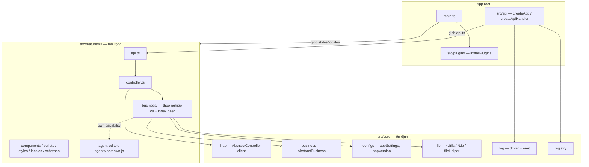

# Cookbook — tái cấu trúc core / feature (PR #174)

Tài liệu chắt lọc từ nhánh `refactor/core-path-reorg` (base `dev/1.0.0/main`). Mục tiêu: tái hiện **vì sao** và **làm thế nào**, không thay [`../architecture.md`](../architecture.md) / [`../../AGENTS.md`](../../AGENTS.md) (hub + bất biến hiện hành).

**Phạm vi:** gom `shared` + `server` vào dưới `src/`, kernel mỏng (`core` / `api` / `plugins`), feature tự chứa route–business–UI–locale–styles–schemas, util/wrapper thống nhất trong `core/lib`.

---

## Triết lý áp dụng

| Triết lý | Ý nghĩa trong tái cấu trúc này |
|----------|--------------------------------|
| **1. Lean — tinh gọn gần core** | Core chỉ giữ abstract, contract, registry, HTTP kernel, util/wrapper. Logic nghiệp vụ không “phình” vào core. Thêm feature = **mở rộng** (file/thư mục mới theo convention), không sửa registry/route hub tay. |
| **2. CI/CD phụ thuộc giao diện** | Layer trên phụ thuộc **hợp đồng** (`AbstractController` / `AbstractBusiness`, Zod schema, `apiGet`/`apiPost`, `*Lib`/`*Utils`) chứ không phụ thuộc class cụ thể của feature khác. Test/build chạy trên biên ổn định. |
| **3. Dễ mở rộng — convention + auto-load** | Feature định nghĩa đúng chỗ (`api.ts`, `styles/index.scss`, `locales/{vi,en}.ts`, `controller`/`business`) → runtime **glob / register** tự nạp. Ít “wiring tập trung”. |

Ba triết lý xuyên suốt các đơn vị commit dưới đây; mỗi đơn vị nêu trước/sau, ưu–nhược–tradeoff và quy tắc rút ra.

---

## Bản đồ đơn vị commit

Gộp theo **đợt kiến trúc** (không phải từng hotfix một). OID theo PR #174.

| # | Đơn vị | Commits |
|---|--------|---------|
| U1 | Core = nền tảng FE/contracts | `e36bc59` |
| U2 | Gom shared + server vào `src/` | `82aea53` |
| U3 | Colocate domain server theo feature | `343778b` |
| U4 | HTTP routes → `features/*/api` | `703d576` |
| U5 | Kernel HTTP/business abstract; bỏ `src/server` | `8da6819`, `2b01026` |
| U6 | FE HTTP client theo feature / consumer | `1069577`, `50ce1e6`, `9bee636` |
| U7 | SCSS theo feature + glob | `13f05e3` |
| U8 | `src/api` setup + `core/http` client + auto-load routes | `6aebbc0`, `f829a0d`, `0176283` |
| U9 | i18n → `plugins` + locale theo feature | `09ea899`, `94c9128`, `15f4078`, `e998b39`, `6a90d41`, `f99d961` |
| U10 | Schema domain → `features/*/schemas` | `5f1dad0`, `7a64a40` |
| U11 | Log ghi/driver → `core/log` | `416ddb6`, `3e6f536`, `6208311`, `10a8b5a` |
| U12 | Util `*Utils` / wrapper `*Lib` trong `core/lib` | `48e06a9`, `ab6005c`, `a889d66` |
| U13 | `fileHelper` + business không import `node:fs`/`path` trực tiếp | `bcdccb5`, `044c16e`, `45366a8` |
| U14 | Sanitize theo feature; peer qua `business/index` | `0de7495` |
| U15 | Gom `business/` theo nghiệp vụ (ít file hơn) | `1d0b10f` |

---

## U1 — Core = nền tảng FE / contracts

**Commits:** `e36bc59` — `refactor(core): chuyển src/shared sang src/core và skeleton shell keys`

### 1. Kiến trúc trước → sau

```
TRƯỚC                         SAU
src/shared/  (FE helpers)  →  src/core/   (ui, composables, i18n, lib, shell…)
                               + skeleton shell keys (chuẩn bị contribution)
```

### 2. Logic trước → sau

- **Trước:** “shared” = túi đồ FE dùng chung, dễ nhầm với `shared/` repo-root (contracts BE↔FE).
- **Sau:** `src/core` là **nền app**; preference / version shell ở `core/configs` (alias `@configs`).

### 3. Ưu / nhược / tradeoff

| | |
|--|--|
| **Ưu** | Tên phản ánh vai trò (nền tảng, không phải “misc”); chuẩn bị shell keys. |
| **Nhược** | Rename hàng loạt import; tạm thời hai nghĩa “shared” (alias vs thư mục). |
| **Tradeoff** | Alias `@configs` = `core/configs`; schema nghiệp vụ vẫn ở `features/*/schemas/`. |

### 4. Quy tắc rút ra

- Đặt tên thư mục theo **vai trò kiến trúc**, không theo “đồ dùng chung”.
- Đợt rename lớn: giữ **alias ổn định** một thời gian, cập nhật docs ngay.

---

## U2 — Gom `shared/` + `server/` vào dưới `src/`

**Commits:** `82aea53` — `refactor(core): chuyển shared và server vào dưới src`

### 1. Kiến trúc trước → sau

```
TRƯỚC (repo root)          SAU
shared/                 →  src/core/configs/  (+ alias @configs)
server/                 →  src/server/          (tạm; sẽ tan vào core/features)
src/                       src/
mcp/                       mcp/  (giữ ngoài — stdio riêng)
```

### 2. Logic trước → sau

- **Trước:** Ba cây song song (`src` SPA, `server` Node, `shared` types) — import relative dài, tooling phải biết nhiều root.
- **Sau:** Một cây `src/` cho app; MCP vẫn ngoài vì transport khác.

### 3. Ưu / nhược / tradeoff

| | |
|--|--|
| **Ưu** | Một mental model; path mirror test dễ hơn. |
| **Nhược** | Diff PR rất lớn; risk nhầm import trong lúc chuyển. |
| **Tradeoff** | Chưa xóa luôn `src/server` trong commit này → migration **theo lớp**, giảm “big bang”. |

### 4. Quy tắc rút ra

- **Migration xếp lớp:** move vật lý trước → colocate → abstract → xóa shim.
- Repo app đơn: ưu tiên **một root source** trừ khi transport bắt buộc tách (MCP).

---

## U3 — Colocate knowledge / logs (và hướng domain) theo feature

**Commits:** `343778b` — `refactor(features): colocate knowledge và logs server vào feature`

### 1. Kiến trúc trước → sau

```
TRƯỚC                              SAU
src/server/knowledge/*          →  src/features/knowledge/business/…
src/server/logging (đọc UI…)    →  src/features/logs/…
(monitor/agents/… còn trong server — các commit sau)
```

### 2. Logic trước → sau

- **Trước:** Feature UI ở `features/X`, domain HTTP cùng feature lại nằm `server/X` — đổi một capability phải nhảy hai cây.
- **Sau:** **Vertical slice** — mọi thứ của capability nằm gần nhau (business trước; route/controller theo U4–U5).

### 3. Ưu / nhược / tradeoff

| | |
|--|--|
| **Ưu** | Ownership rõ; xóa/thêm feature ít đụng chỗ khác. |
| **Nhược** | Một số module (log ghi request) vẫn cross-cutting → chưa colocate hết (xem U11). |
| **Tradeoff** | Colocate “đủ dùng” trước, tách cross-cut sau khi ranh giới rõ. |

### 4. Quy tắc rút ra

- **Feature = đơn vị ownership**, không phải “tầng kỹ thuật” (`server/` vs `src/`).
- Cross-cutting (audit log, registry) → core; domain đọc/ghi nghiệp vụ → feature.

---

## U4 — HTTP routes → `features/*/api.ts`

**Commits:** `703d576` — `refactor(features): chuyển HTTP routes vào features/*/api`

### 1. Kiến trúc trước → sau

```
TRƯỚC                               SAU
server/http/routes/*.ts (hub)    →  features/<name>/api.ts
                                    (map path → handler; sau gắn bind/controller)
```

### 2. Logic trước → sau

- **Trước:** Thêm endpoint = sửa file route tập trung + import domain từ server.
- **Sau:** Mỗi feature khai báo route của mình; hub dần chỉ còn load/aggregate.

### 3. Ưu / nhược / tradeoff

| | |
|--|--|
| **Ưu** | Open for extension: feature mới mang route theo; khớp Lean. |
| **Nhược** | Cần quy ước `routeOrder` / đăng ký để tránh đụng path. |
| **Tradeoff** | Phân tán route → khó “nhìn một file là hết API”; bù bằng docs + convention + test golden routes. |

### 4. Quy tắc rút ra

- **Không** có file “god routes”; đăng ký qua convention (`api.ts`).
- Path collision giải bằng quy ước thứ tự / test liệt kê route.

---

## U5 — Kernel abstract + bỏ `src/server`

**Commits:**

- `8da6819` — kernel server vào core, business theo feature  
- `2b01026` — hoàn thiện controller/api, `AbstractBusiness`, xóa `src/server`

### 1. Kiến trúc trước → sau

```
TRƯỚC                         SAU
src/server/http/…          →  src/core/http/   (types, AbstractController, respond)
src/server/<domain>/…      →  features/*/business/ + controller.ts
(handler rải / ad-hoc)     →  AbstractController + AbstractBusiness
src/server/ (còn sót)      →  (xóa)
```

### 2. Logic trước → sau

- **Trước:** Handler HTTP biết cả parse request lẫn filesystem domain; khó test, dễ vòng phụ thuộc.
- **Sau:**
  - `controller` — HTTP biên (parse → gọi business → `json`/`ok`)
  - `business` — data thuần, `requireRoot`/`fail`, **không** import Hono
  - Core chỉ export **abstract + types**, không biết feature cụ thể

### 3. Ưu / nhược / tradeoff

| | |
|--|--|
| **Ưu** | Test business không cần HTTP; CI phụ thuộc interface; core ổn định. |
| **Nhược** | Boilerplate class/file; team phải học “chỗ nào đặt gì”. |
| **Tradeoff** | Abstract class thay vì chỉ function+ctx — đổi lấy đồng nhất controller/business và `bind()`. |

### 4. Quy tắc rút ra

- **Phụ thuộc một chiều:** `lib/configs` → `business` → `controller` → `api` setup.
- Feature **không** import feature khác qua tầng HTTP; chia sẻ qua configs/lib hoặc API HTTP.
- Trong `business/`: chia theo **nghiệp vụ đang xử lý cái gì**, không theo kiểu thao tác kỹ thuật — tránh tạo quá nhiều file làm phân tán business.
- Xóa cây cũ ngay khi không còn import (tránh 2 nhà).

---

## U6 — FE HTTP client theo feature / consumer

**Commits:**

- `1069577` — tách FE client theo feature  
- `50ce1e6` — `*Api` theo consumer + `apiGet`/`apiPost`  
- `9bee636` — chuyển vào `scripts/`, tách theo component

### 1. Kiến trúc trước → sau

```
TRƯỚC                            SAU
src/api/ (barrel lớn / lẫn)   →  core/http/client.ts     (primitive)
                                 features/*/scripts/*Api.ts  (theo màn / consumer)
```

### 2. Logic trước → sau

- **Trước:** Một (vài) module API FE import chéo; đổi endpoint một mode đụng file chung.
- **Sau:** Primitive fetch ổn định ở core; mỗi component/composable có `scripts/XxxApi.ts` gần consumer.

### 3. Ưu / nhược / tradeoff

| | |
|--|--|
| **Ưu** | Ít coupling FE giữa mode; dễ tìm “ai gọi endpoint này”. |
| **Nhược** | Nhiều file nhỏ; duplicate pattern nếu không có `apiGet`/`apiPost`. |
| **Tradeoff** | Tách theo consumer (không chỉ theo resource) → trùng endpoint có thể lặp 2 wrapper; chấp nhận để ownership UI rõ. |

### 4. Quy tắc rút ra

- **Primitive ở core, orchestration ở feature.**
- Đặt `*Api` cạnh chỗ dùng (`scripts/`), không nhét barrel `src/api` cho FE.

---

## U7 — SCSS theo feature + glob

**Commits:** `13f05e3` — `refactor(styles): chuyển SCSS vào features/*/styles và glob nạp từ main.ts`

### 1. Kiến trúc trước → sau

```
TRƯỚC                              SAU
src/styles/ phình theo mode     →  src/styles/ = token + shell
                                   features/*/styles/{common,Component,index}.scss
                                   main.ts: import.meta.glob(.../styles/index.scss)
```

### 2. Logic trước → sau

- **Trước:** Thêm mode = sửa `main.scss` (hoặc cây styles trung tâm).
- **Sau:** Feature tự mang `styles/index.scss`; **glob eager** nạp — không liệt kê tay.

### 3. Ưu / nhược / tradeoff

| | |
|--|--|
| **Ưu** | Đúng Lean + auto-load; CSS ownership theo feature. |
| **Nhược** | Thứ tự load phụ thuộc glob; debug “style nào thắng” khó hơn một chút. |
| **Tradeoff** | Token/` :root` vẫn global — feature style phụ thuộc biến theme, không copy token. |

### 4. Quy tắc rút ra

- **Shell token tập trung; skin feature phân tán.**
- Pattern glob lặp lại cho locales / routes (cùng triết lý).

---

## U8 — `src/api` setup + auto-load feature routes

**Commits:**

- `6aebbc0` — setup HTTP vào `src/api`, phase → `core/lib`  
- `f829a0d` — FE client vào `core/http`, load routes trong `apiServer`  
- `0176283` — fallback static load khi Vite Node không glob được

### 1. Kiến trúc trước → sau

```
TRƯỚC                                SAU
devTeamApi / createApp lẫn logic  →  src/api/apiServer.ts  (createApp + createApiHandler)
                                     src/api/devTeamApi.ts (shim Vite mỏng)
                                     registerFeatureRoutes: loadModulesUnder(features/*/api.ts)
```

### 2. Logic trước → sau

- **Trước:** Đăng ký route thủ công hoặc gắn chặt transport.
- **Sau:** App setup chỉ biết **cách load**; danh sách feature đến từ filesystem. Shim Vite không chứa domain.

### 3. Ưu / nhược / tradeoff

| | |
|--|--|
| **Ưu** | Core/api ổn định khi thêm feature; transport (Vite/Node) dùng chung handler. |
| **Nhược** | Glob phụ thuộc bundler — cần fallback (`0176283`) khi runtime khác Vite. |
| **Tradeoff** | Auto-load + fallback tĩnh = hai đường; đổi lấy CI/dev không gãy khi tooling lệch. |

### 4. Quy tắc rút ra

- **App root chỉ wire:** tạo app, resolve project, log request, load plugin/feature.
- Mọi cơ chế auto-load cần **đường dự phòng có test** (Vite Node, bun, …).
- `phase` là suy diễn thuần → `core/lib`, không nhét controller.

---

## U9 — i18n plugins + locale theo feature

**Commits:** `09ea899`, `94c9128`, `15f4078`, `e998b39`, `6a90d41`, `f99d961`

### 1. Kiến trúc trước → sau

```
TRƯỚC                                  SAU
src/core/i18n/locales (khổng lồ)    →  plugins/i18n (+ common)
useI18n() rải / type chặt en↔vi     →  features/*/locales/{vi,en}.ts (glob)
                                        useI18nHelpers() đọc $t global
                                        fallbackLocale: 'vi' (bỏ schema strict)
```

### 2. Logic trước → sau

- **Trước:** Locale trong core → core phình; thiếu key `en` = lỗi type (cứng).
- **Sau:** Plugin cài i18n app-scope; feature tự mang message; `$t` inject một lần từ `main` → `installPlugins`; helper core **không** import `vue-i18n` trực tiếp trong SFC pattern mới.

### 3. Ưu / nhược / tradeoff

| | |
|--|--|
| **Ưu** | Core gầy; feature độc lập i18n; fallback `vi` giảm ma sát đóng góp. |
| **Nhược** | Mất đảm bảo compile-time đủ `en`; dễ lệch bản dịch. |
| **Tradeoff** | Strict đối ứng locale ↔ tốc độ ship / Lean core — chọn fallback runtime. |

### 4. Quy tắc rút ra

- **Plugin = thư viện app-scope** (i18n…); **feature = nội dung**.
- Không để SFC phụ thuộc deep import `vue-i18n` nếu đã inject global — một cửa `useI18nHelpers`.
- Module augmentation gom một chỗ (`plugins/i18n/index`) tránh file `types` lạc.

---

## U10 — Schema domain theo feature

**Commits:** `5f1dad0`, `7a64a40`

### 1. Kiến trúc trước → sau

```
TRƯỚC                                   SAU
core/configs/* (hỗn hợp)   →  features/<f>/schemas/*  (task, autoscan, …)
                                        core/configs/appSettings  (shell)
```

### 2. Logic trước → sau

- **Trước:** Mọi Zod ở contracts → core/gián tiếp phụ thuộc shape mọi feature.
- **Sau:** Schema đi với owner feature; **appSettings** ở lại core vì plugins/shell đọc.

### 3. Ưu / nhược / tradeoff

| | |
|--|--|
| **Ưu** | Không vòng `core → features`; Zod gần biên I/O của feature. |
| **Nhược** | Import schema phải biết feature path; chia sẻ schema giữa 2 feature cần rút contracts/lib cẩn thận. |
| **Tradeoff** | Chỉ giữ ở core những schema **shell thật sự** dùng. |

### 4. Quy tắc rút ra

- **Quy tắc sở hữu schema:** ai validate biên I/O → người đó giữ file Zod.
- Cấm `core` import `features` vì schema — dấu hiệu đặt sai chỗ.

---

## U11 — `core/log` (ghi + driver) vs feature `logs` (đọc UI)

**Commits:** `416ddb6`, `3e6f536`, `6208311`, `10a8b5a`

### 1. Kiến trúc trước → sau

```
TRƯỚC                              SAU
logging gắn feature/server lẫn  →  src/core/log/  (schema, driver, append/emitAudit)
                                   features/logs/ (UI, job log stream, đọc)
test log chạy nhầm vitest       →  bun test + exclude vitest
```

### 2. Logic trước → sau

- **Trước:** Ghi request/audit có thể kéo phụ thuộc UI/feature.
- **Sau:** `createApiHandler` / controller gọi **interface driver** (`getLogDriver`); file driver mặc định; feature logs chỉ consume.

### 3. Ưu / nhược / tradeoff

| | |
|--|--|
| **Ưu** | Đúng tách cross-cut; test driver bằng bun (Node fs). |
| **Nhược** | Hai “logs” (core ghi / feature đọc) — cần docs rõ. |
| **Tradeoff** | Driver inject thay vì import file cứng → test giả driver dễ; thêm indirection. |

### 4. Quy tắc rút ra

- **Ghi nhật ký hạ tầng ≠ màn hình Nhật ký.**
- Chọn test runner theo I/O thật (fs/network → bun; DOM → vitest).
- Typecheck sau đổi i18n/helpers: sửa ngay tại biên (`useI18nHelpers`, signature business).

---

## U12 — `*Utils` / `*Lib` trong `src/core/lib`

**Commits:**

- `48e06a9` — `markdown` → `markdownLib`  
- `ab6005c` — gom string/array/date/yaml/diff + wire import  
- `a889d66` — tách `node:fs` khỏi `yamlLib` (Vite build)

### 1. Kiến trúc trước → sau

```
TRƯỚC                                 SAU
slugify copy-paste nhiều chỗ       →  stringUtils / arrayUtils / dateUtils
import js-yaml / diff / marked rải →  yamlLib / diffLib / markdownLib
yamlLib kèm fs.readFile            →  yamlLib thuần (browser-safe);
                                      readYamlSafe ở contracts/fs
```

### 2. Logic trước → sau

- **Trước:** Helper dữ liệu và wrapper package nằm lẫn contracts / component local.
- **Sau:** Quy ước tên rõ; FE import được `yamlLib` qua `agentMarkdown` mà **không** kéo `node:fs` vào bundle.

### 3. Ưu / nhược / tradeoff

| | |
|--|--|
| **Ưu** | Một nơi sửa slug/YAML; ranh giới Node vs browser rõ. |
| **Nhược** | `agentMarkdown.js` import đuôi `.ts` (quirk bundler); thêm file quy ước. |
| **Tradeoff** | Tách `readYamlSafe` khỏi `yamlLib` = thêm một hop import, đổi lấy build FE xanh. |

### 4. Quy tắc rút ra

- **`*Utils` = thao tác kiểu dữ liệu; `*Lib` = biên thư viện bên thứ ba.**
- Module dùng chung FE+BE **không** top-level import `node:*`.
- Plain `.js` import `.ts`: kiểm tra Vite resolve (đuôi `.ts` / extensionless) trước khi xanh CI.

---

## U13 — `fileHelper` + business dùng wrap fs/path

**Commits:**

- `bcdccb5` — gom frontmatter vào `yamlLib`, tách `fileHelper`  
- `044c16e` — business dùng `fileHelper` thay `node:fs` / `node:path`  
- `45366a8` — sửa overload type (`readDir` / `watch`) + call site typecheck

### 1. Kiến trúc trước → sau

```
TRƯỚC                                      SAU
contracts/fs + yamlLib lẫn đọc file     →  yamlLib (parse/dump + readYamlSafe);
business import node:fs / node:path rải →  fileHelper (path + fs sync/async + safe*)
watch / readDir type lỏng               →  overload đúng → vue-tsc xanh
```

### 2. Logic trước → sau

- **Trước:** Mỗi business tự `import path from 'node:path'` / `fs` — khó siết defensive I/O và dễ lệch API.
- **Sau:** Business gọi `joinPath` / `readTextFile` / `safeReadDir` / …; `fileHelper` là biên Node duy nhất cho fs/path trong domain. Type overload quan trọng: `readDir(dir, { withFileTypes: true })` phải suy ra `Dirent[]`.

### 3. Ưu / nhược / tradeoff

| | |
|--|--|
| **Ưu** | Một chỗ mở rộng API fs; CI typecheck bắt call site sai sớm. |
| **Nhược** | Wrapper phải giữ overload gần `node:fs`; call site không còn truyền `'utf8'` thừa. |
| **Tradeoff** | Business phụ thuộc `fileHelper` thay vì API Node thuần — đổi lấy đồng nhất + tree-shake FE (không import `fileHelper` từ module browser). |

### 4. Quy tắc rút ra

- **Business không import `node:fs` / `node:path`** — dùng `fileHelper` (hoặc mở rộng helper đó).
- `yamlLib` / `*Lib` dùng chung FE: không kéo `node:fs` top-level.
- Thêm API fs mới: **mở rộng `fileHelper` + overload TypeScript**, rồi mới migrate call site; chạy `bun run typecheck`.

---

## U14 — Sanitize theo feature + peer qua `business/index`

**Commits:** `0de7495` — tách sanitize theo feature, peer qua `business/index`

### 1. Kiến trúc trước → sau

```
TRƯỚC                                      SAU
core/configs/sanitize.ts (túi chung)  →  gắn vào module business sở hữu
                                           (pipeline, agents, tasks, jobLog, …)
feature A import sâu B/business/x.ts    →  chỉ A/business/index.ts được import
                                           từ B/business/**; nội bộ A đi qua
                                           ./business/index (hoặc ./index)
```

### 2. Logic trước → sau

- **Trước:** Sanitize “dùng chung” nằm core → core biết tên domain; feature import ngang cây peer dễ vòng / coupling kín.
- **Sau:** Hàm sanitize sống cạnh nghiệp vụ sở hữu; chia sẻ qua **barrel `business/index.ts`**. Controller / module nội bộ không import thẳng `features/<khác>/business/...`.

### 3. Ưu / nhược / tradeoff

| | |
|--|--|
| **Ưu** | Ownership rõ; core gầy; biên peer kiểm soát được. |
| **Nhược** | `index.ts` phải re-export đủ peer surface; dễ quên cập nhật barrel. |
| **Tradeoff** | Có thể re-export sâu từ peer (tránh barrel↔barrel cycle) thay vì chỉ export “công khai đẹp”. |

### 4. Quy tắc rút ra

- **Sanitize / rule domain gắn feature sở hữu**, không nhét core.
- **Chỉ `business/index.ts` được import cây business feature khác.**
- Khi thêm export peer: cập nhật index của cả bên sở hữu và bên tiêu thụ (nếu re-export).

---

## U15 — Gom `business/` theo nghiệp vụ

**Commits:** `1d0b10f` — gom business theo nghiệp vụ, giảm tách file

### 1. Kiến trúc trước → sau

```
TRƯỚC (tách theo kiểu thao tác)          SAU (theo nghiệp vụ đang xử lý)
agent-editor: paths/store/fetch/…     →  agents.ts (+ generate.ts)
catalog: builtins + dedupe riêng      →  nằm trong catalog/index
settings: autoscan/config + scan      →  dashboardSettings + autoscan
runner: pidReaper / sessionCapture…   →  gắn jobQueue / sessionLedger / registry
```

### 2. Logic trước → sau

- **Trước:** Nhiều file nhỏ theo “loại xử lý” (`store`, `fetch`, `scan`, `paths`) → phân tán, khó nắm capability.
- **Sau:** Hỏi *“nghiệp vụ này đang xử lý cái gì?”* rồi gom; chỉ tách khi file đủ lớn hoặc biên capability rõ (`catalog/scan`, `tasks/create` vs `state`, `providers/*`).

### 3. Ưu / nhược / tradeoff

| | |
|--|--|
| **Ưu** | Ít file; ownership theo capability; rename/import ổn định hơn. |
| **Nhược** | Một file có thể dài hơn; cần kỷ luật không nhồi capability lạ vào cùng file. |
| **Tradeoff** | Không ép “một file = một hàm”; chấp nhận module dày nếu cùng một nghiệp vụ. |

### 4. Quy tắc rút ra

- **Chia `business/` theo nghiệp vụ đang xử lý**, không theo loại thao tác kỹ thuật.
- Helper nhỏ gắn vào module capability — không tạo file chỉ vì “kiểu xử lý”.
- Tách module khi: biên capability rõ **hoặc** file đã quá lớn khó review.

---

## Sơ đồ kiến trúc tổng (sau tái cấu trúc)



**Đọc sơ đồ theo Lean:** mũi tên phụ thuộc hướng vào core/configs/lib; feature mới **thêm hộp**, không sửa hộp core trừ khi đổi abstract.

---

## Checklist khi thêm feature mới (sau cookbook này)

1. Tạo `src/features/<name>/` với `api.ts`, `controller.ts`, `business/`, (tuỳ) `components`, `scripts`, `styles/index.scss`, `locales/{vi,en}.ts`, `schemas/`.
2. Controller `extends AbstractController`; business `extends AbstractBusiness`.
3. `business/` gom theo nghiệp vụ; peer chỉ qua `business/index.ts`.
4. Không sửa `apiServer` registry tay — để glob/`registerFeatureRoutes` nạp.
5. Schema domain để trong feature; đừng đẩy vào `core/configs` trừ shell preference thật sự.
6. Dùng `*Utils` / `*Lib` / `fileHelper` có sẵn; mở rộng helper trước khi copy logic.
7. Business không import trực tiếp `node:fs` / `node:path`.
8. Chạy `bun run typecheck` + `bun run build` nếu đụng FE+Node.

Chi tiết quy ước đặt file & review: [`../implement/feature-organization-rule.md`](../implement/feature-organization-rule.md), [`../implement/review-checklist-rule.md`](../implement/review-checklist-rule.md).

---

## Liên kết

- Kiến trúc hiện hành: [`../architecture.md`](../architecture.md)
- Tổ chức feature / business: [`../implement/feature-organization-rule.md`](../implement/feature-organization-rule.md)
- Coding convention: [`../implement/coding-convention.md`](../implement/coding-convention.md)
- Checklist review: [`../implement/review-checklist-rule.md`](../implement/review-checklist-rule.md)
- Hub agent / bất biến: [`../../AGENTS.md`](../../AGENTS.md)
- i18n: [`../i18n.md`](../i18n.md)
- SCSS: [`../architecture.md`](../architecture.md) §3.3
- PR: https://github.com/naut1402/agent-workflow/pull/174
