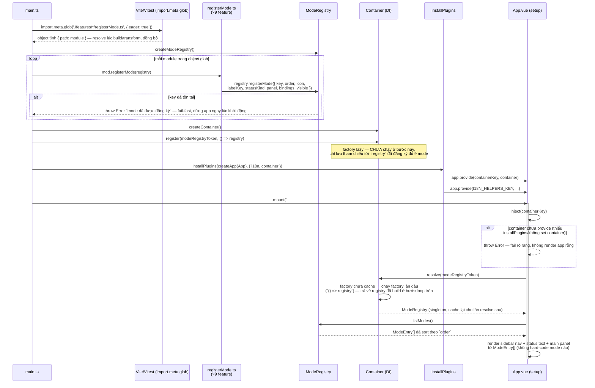
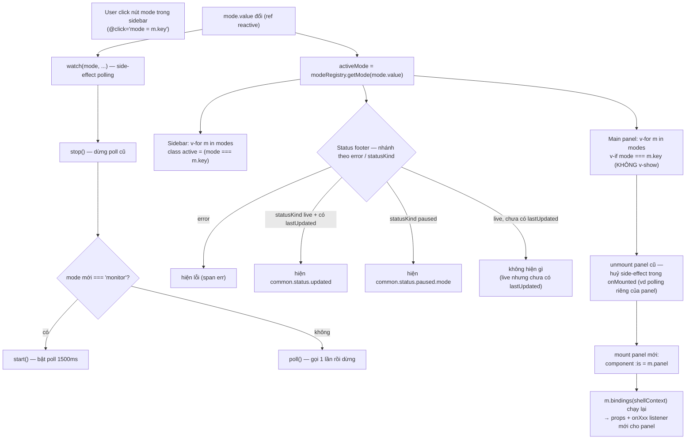

# IoC bootstrap + runtime flow — service container + ModeRegistry

2 sơ đồ cho service container (DI/IoC) và `ModeRegistry` ở FE shell: **(1) bootstrap** — từ lúc `main.ts` chạy tới lúc `App.vue` render lần đầu; **(2) runtime** — điều gì xảy ra mỗi khi user chuyển mode, sau khi app đã bootstrap xong. Hub: [`../../AGENTS.md`](../../AGENTS.md); kiến trúc tổng quan: [`../architecture.md`](../architecture.md) §3; quy ước thêm mode mới: [`../implement/mode-registry-convention.md`](../implement/mode-registry-convention.md).

---

## 1. Sơ đồ bootstrap (sequence)

---

### Diễn giải — bootstrap

#### 1. Glob thay vì import/gọi tay (bước 1–2)

`main.ts` không `import` và gọi tay từng `registerXMode()`. Thay vào đó dùng `import.meta.glob('./features/*/registerMode.ts', { eager: true })` — Vite (dev/build) và Vitest (test) transform pattern này thành **1 object tĩnh** `{ "<path>": <module> }` ngay lúc biên dịch, tương đương việc `import` sẵn tất cả file khớp pattern. `eager: true` là điểm mấu chốt: nếu đổi thành `eager: false` (mặc định), mỗi entry sẽ là `() => import(...)` — dynamic import async — phá vỡ bất biến "đăng ký đồng bộ trước khi App.vue đọc registry lần đầu".

Hệ quả thực dụng: thêm 1 feature mới chỉ cần tạo đúng 1 file `src/features/<feature>/registerMode.ts` — không đụng `main.ts`.

#### 2. Đăng ký vào `ModeRegistry` (bước loop)

`main.ts` gọi `createModeRegistry()` tạo 1 registry rỗng, rồi lặp qua từng module trong object glob, gọi `mod.registerMode(registry)` — mỗi feature tự đẩy `ModeEntry` của mình vào registry dùng chung. `registry.registerMode()` throw ngay nếu `key` trùng — lỗi này xảy ra **đồng bộ, ngay lúc `main.ts` chạy**, tức là app sẽ crash sớm ở console/build thay vì lỗi ngầm lúc runtime khi user chuyển mode.

#### 3. Container chỉ là 1 lớp gián tiếp mỏng (bước `register(modeRegistryToken, ...)`)

`container.register(modeRegistryToken, () => registry)` **không** chạy factory ngay — chỉ lưu tham chiếu. Điểm quan trọng dễ hiểu nhầm: **registry đã được build đầy đủ (9 mode) từ bước loop phía trên, độc lập với việc container có lazy hay không** — factory ở đây chỉ trả lại đúng object `registry` đã có sẵn, container không tự "xây" gì thêm. Nói cách khác: laziness của container chỉ ảnh hưởng tới **thời điểm App.vue lấy được registry**, không ảnh hưởng tới **thời điểm registry được điền dữ liệu** (luôn luôn là lúc `main.ts` chạy, trước `app.mount()`).

#### 4. `installPlugins` cài container vào cây Vue (bước `app.provide`)

`installPlugins(app, { i18n, container })` gọi `app.provide(containerKey, container)` — dùng cơ chế `provide/inject` gốc của Vue, không thêm thư viện DI ngoài. Đây là **composition root** duy nhất biết cả i18n lẫn container — feature con không tự tạo container riêng.

#### 5. `App.vue` resolve registry lúc `setup()` (bước `inject` → `resolve` → `listModes`)

Khi Vue chạy `setup()` của `App.vue` (trong lúc `mount()`), `App.vue`:
1. `inject(containerKey)` — nếu `undefined` (quên `installPlugins` hoặc test quên `provide`) → throw ngay, không lặng lẽ render app rỗng.
2. `container.resolve(modeRegistryToken)` — lần đầu resolve nên container mới chạy factory, nhưng vì registry đã đầy đủ sẵn từ bước 2 nên `resolve()` trả về ngay, không có async gap, không risk thiếu mode.
3. `modeRegistry.listModes()` — trả `ModeEntry[]` đã sort theo `order`, dùng để lặp `v-for` render sidebar nav, status text, main panel (`<component :is="m.panel" v-bind="m.bindings?.(shellContext) ?? {}" />`).

#### 6. Vì sao thứ tự này quan trọng

Nếu đảo thứ tự — vd `app.mount()` trước khi glob/loop đăng ký mode chạy xong — `App.vue` sẽ `resolve()` một `ModeRegistry` rỗng hoặc thiếu mode, và vì `registerMode()` không được gọi lại sau đó, sidebar sẽ thiếu mode vĩnh viễn cho tới khi reload. Thứ tự bắt buộc: **glob (đồng bộ) → loop đăng ký → tạo container → `installPlugins` → `mount()`** — đúng như code hiện tại ở `src/main.ts`, không đảo được.

---

## 2. Sơ đồ runtime — chuyển mode (sau bootstrap)

Bootstrap chỉ chạy 1 lần lúc load trang. Sơ đồ dưới mô tả điều gì lặp lại mỗi khi user click 1 nút mode khác trong sidebar — đây là lúc `ModeEntry` đã đăng ký ở bước bootstrap thực sự được "tiêu thụ".

### Diễn giải — runtime

#### 1. `mode.value` là state duy nhất App.vue tự sở hữu về "đang ở mode nào"

Click sidebar chỉ đổi 1 ref (`mode.value = m.key`) — không tự gọi `registry.registerMode()` hay đụng gì tới container/registry (2 cái đó đã cố định từ bootstrap, không đổi trong suốt vòng đời app). `activeMode = computed(() => modeRegistry.getMode(mode.value))` tra cứu lại `ModeEntry` tương ứng mỗi khi `mode` đổi — đây là nơi duy nhất runtime "hỏi lại" registry.

#### 2. Polling side-effect tách khỏi phần render (`watch(mode, ...)`)

Đổi mode luôn `stop()` polling cũ; chỉ `mode === 'monitor'` mới `start()` polling lặp 1500ms, mọi mode khác `poll()` đúng 1 lần rồi dừng. Nhánh này **không** đọc `ModeEntry`/`statusKind` — nó hard-code theo `'monitor'` (mode duy nhất thật sự cần poll liên tục), tách biệt khỏi phần hiển thị. Nếu 1 mode mới cũng cần polling liên tục kiểu tương tự, đây là chỗ cần cân nhắc sửa — không phải bất biến tự động theo `registerMode.ts`.

#### 3. Status text nhánh theo `statusKind`, không theo mode cụ thể

`App.vue` không còn biết mode nào tên gì — chỉ hỏi `activeMode?.statusKind` (`'live' | 'paused'`) để chọn 1 trong 2 dạng câu chữ chung (`common.status.updated` / `common.status.paused.<mode>`). Thêm mode mới với `statusKind: 'paused'` tự động có đúng dòng trạng thái mà không cần sửa nhánh `if/else` nào ở `App.vue`.

#### 4. `v-if` trong `v-for` — mount/unmount thật, không phải ẩn/hiện

Điểm dễ nhầm nhất: main-panel loop dùng `v-if="mode === m.key"` (không phải `v-show`) — nghĩa là mỗi lần chuyển mode, Vue **destroy hẳn instance panel cũ** (huỷ mọi `onMounted`/`watch`/timer nội bộ của nó) rồi **tạo instance mới** cho panel sắp hiện, gọi lại `m.bindings(shellContext)` để lấy props/listener mới nhất. Đổi sang `v-show` sẽ mount **toàn bộ** panel cùng lúc — sai vì nhiều panel có side-effect (fetch/polling) chạy ngay trong `onMounted`.

#### 5. `visible(ctx)` — không nằm trong flow "click mode" ở trên

`modes = computed(() => modeRegistry.listModes().filter(m => !m.visible || m.visible(shellContext.value)))` refilter mỗi khi **`shellContext` đổi** (vd `showLogsTab` bật/tắt từ Settings), **không** phụ thuộc `mode.value`. Đây là 1 trigger riêng, không nằm trong sơ đồ trên (sơ đồ trên giả định danh sách `modes` đã ổn định lúc user click) — nếu mode đang active bị `visible()` trả về `false` giữa chừng (vd tắt Logs khi đang ở tab Logs), `App.vue` có logic riêng chuyển về `monitor` (xem `onLoggingChanged`), không phải hệ quả tự động của registry.

---

## Tham chiếu code thật

| Bước trong sơ đồ | File |
|---|---|
| Glob + loop đăng ký, tạo container | `src/main.ts` |
| `ModeEntry`, `createModeRegistry`, `modeRegistryToken` | `src/core/shell/modeRegistry.ts` |
| `Container` (`register`/`resolve`), `createToken` | `src/core/container/{index,types}.ts` |
| `containerKey` (`InjectionKey<Container>`) | `src/core/shell/containerKey.ts` |
| `installPlugins` (`app.provide(containerKey, ...)`) | `src/plugins/index.ts` |
| `inject`/`resolve`/`listModes`, render sidebar/main panel, `watch(mode, ...)` polling, `shellContext`, `activeMode` | `src/App.vue` |
| Mỗi feature tự đăng ký `ModeEntry` (`bindings`, `visible`, `statusKind`, ...) | `src/features/<feature>/registerMode.ts` |
| `useTaskPolling` (poll 1500ms khi mode `monitor`) | `src/features/monitor/composables/useTaskPolling.ts` |
