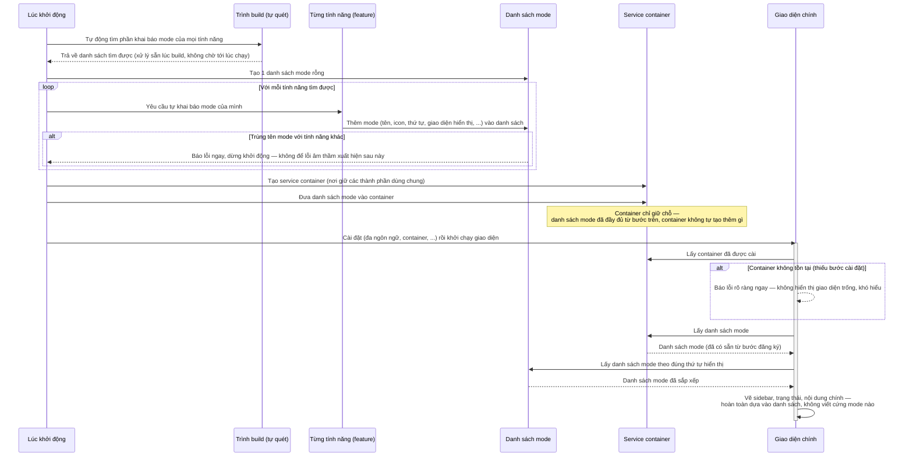
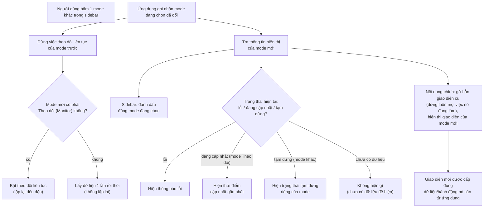

# IoC bootstrap + runtime flow — service container + ModeRegistry

2 sơ đồ giải thích **khái niệm** vận hành của service container (DI/IoC) và danh sách mode (`ModeRegistry`) ở FE shell: **(1) bootstrap** — chuyện gì xảy ra lúc ứng dụng khởi động; **(2) runtime** — chuyện gì xảy ra mỗi khi người dùng chuyển mode. Tài liệu này viết theo hướng dễ hiểu ý tưởng, hạn chế trích code — muốn xem đúng dòng code/API cụ thể, xem bảng tham chiếu ở cuối hoặc [`../implement/mode-registry-convention.md`](../implement/mode-registry-convention.md) (quy ước dành cho người viết code). Hub: [`../../AGENTS.md`](../../AGENTS.md); kiến trúc tổng quan: [`../architecture.md`](../architecture.md) §3.

---

## 1. Sơ đồ bootstrap — lúc ứng dụng khởi động

### Diễn giải — bootstrap

**1. Tự động tìm mode, không khai báo tay.** Lúc khởi động, ứng dụng tự quét toàn bộ tính năng để tìm phần mỗi tính năng tự khai báo mode của mình — không cần liệt kê tay từng mode trong 1 chỗ trung tâm. Nhờ vậy, thêm 1 tính năng mới không cần sửa file khởi động chung của ứng dụng.

**2. Mỗi tính năng tự "giới thiệu" mode của mình.** Thông tin cần thiết (tên, icon, thứ tự hiển thị, giao diện tương ứng...) do chính tính năng khai báo, đẩy vào 1 danh sách dùng chung. Nếu 2 tính năng lỡ trùng tên mode, ứng dụng báo lỗi ngay lúc khởi động thay vì để lỗi âm thầm xuất hiện khi người dùng đang thao tác.

**3. Container chỉ là nơi giữ chỗ, không tự tạo dữ liệu.** Service container không tự xây danh sách mode — nó chỉ giữ 1 đường dẫn tới danh sách đã có sẵn (đã đầy đủ từ bước trước). Danh sách mode luôn hoàn chỉnh trước khi container "biết" tới nó.

**4. Container được gắn vào toàn bộ giao diện ở 1 chỗ duy nhất.** Bước cài đặt đưa container vào gốc của cây giao diện, để bất kỳ phần nào bên trong (ở đây là màn hình chính) cũng lấy được, không cần truyền tay qua nhiều lớp trung gian.

**5. Giao diện chính chỉ "hỏi" danh sách mode để vẽ.** Màn hình chính lấy container, từ đó lấy danh sách mode, rồi dùng đúng danh sách đó để vẽ sidebar, trạng thái, và nội dung — nó không còn biết trước "có bao nhiêu mode, mode nào" nữa.

**6. Vì sao thứ tự các bước quan trọng.** Nếu giao diện chính được khởi chạy trước khi các tính năng kịp đăng ký mode, sidebar sẽ thiếu mode và không tự khắc phục được — phải tải lại trang. Vì vậy thứ tự bắt buộc: quét + đăng ký mode xong hoàn toàn, rồi mới khởi chạy giao diện.

---

## 2. Sơ đồ runtime — khi người dùng chuyển mode

Bootstrap chỉ chạy 1 lần lúc tải trang. Sơ đồ dưới mô tả điều lặp lại mỗi khi người dùng bấm sang 1 mode khác.

### Diễn giải — runtime

**1. Chỉ 1 thông tin đổi: mode nào đang chọn.** Bấm sidebar chỉ đổi "mode đang chọn hiện tại" — không đụng gì tới container hay danh sách mode (2 cái đó cố định từ lúc khởi động, không đổi trong suốt phiên dùng app). Ứng dụng chỉ tra lại thông tin hiển thị tương ứng mỗi khi lựa chọn đổi.

**2. Việc theo dõi liên tục tách riêng khỏi phần hiển thị.** Đổi mode luôn dừng việc theo dõi liên tục trước đó; chỉ mode Theo dõi (Monitor) mới cần bật lại theo dõi lặp lại đều đặn, mọi mode khác chỉ lấy dữ liệu đúng 1 lần rồi dừng. Đây là quy tắc **hard-code riêng cho mode Theo dõi** (mode duy nhất thật sự cần cập nhật liên tục) — không tự động áp dụng cho mode mới nào khác có nhu cầu tương tự.

**3. Dòng trạng thái chọn theo "kiểu trạng thái" chung, không theo tên mode cụ thể.** Ứng dụng không còn biết mode nào tên gì để quyết định hiển thị gì — nó chỉ hỏi "mode này thuộc kiểu nào: đang cập nhật liên tục, hay tạm dừng" để chọn 1 trong 2 dạng câu chữ chung. Mode mới thuộc kiểu "tạm dừng" tự động có đúng dòng trạng thái mà không cần thêm nhánh xử lý riêng.

**4. Chuyển mode = thay hẳn giao diện, không phải ẩn/hiện.** Điểm dễ nhầm nhất: mỗi lần chuyển mode, ứng dụng **gỡ bỏ hoàn toàn** giao diện của mode cũ (dừng luôn mọi việc nó đang tự làm ngầm, như theo dõi hay tải dữ liệu riêng) rồi mới dựng giao diện mới cho mode sắp hiện, cấp lại đúng dữ liệu/hành động nó cần. Nếu chỉ *ẩn* giao diện cũ thay vì gỡ hẳn, mọi mode sẽ cùng chạy ngầm 1 lúc — sai, vì nhiều mode tự tải dữ liệu/theo dõi riêng ngay khi hiện lên lần đầu.

**5. Ẩn/hiện 1 mode khỏi sidebar là chuyện khác, không nằm trong flow này.** 1 mode có thể tự ẩn khỏi sidebar tuỳ theo cấu hình khác của ứng dụng (vd tắt 1 tính năng trong Cài đặt) — việc này xảy ra khi cấu hình đó đổi, không phải khi người dùng bấm chuyển mode như sơ đồ trên.

---

## Tham chiếu code thật

Bảng dưới dành cho ai cần xem đúng code — sơ đồ + diễn giải ở trên cố tình không trích code để dễ đọc.

| Khái niệm trong sơ đồ | File |
|---|---|
| Tự quét + đăng ký mode lúc khởi động, tạo container | `src/main.ts` |
| Danh sách mode (`ModeEntry`, `ModeRegistry`) | `src/core/shell/modeRegistry.ts` |
| Service container (`register`/`resolve`) | `src/core/container/{index,types}.ts` |
| Khoá để lấy container trong giao diện | `src/core/shell/containerKey.ts` |
| Bước cài đặt container vào giao diện | `src/plugins/index.ts` |
| Màn hình chính: lấy danh sách mode, vẽ sidebar/trạng thái/nội dung, xử lý theo dõi liên tục | `src/App.vue` |
| Mỗi tính năng tự khai báo mode của mình | `src/features/<feature>/registerMode.ts` |
| Theo dõi liên tục của mode Theo dõi (Monitor) | `src/features/monitor/composables/useTaskPolling.ts` |

Quy ước dành cho người viết code (checklist thêm mode mới, field chi tiết): [`../implement/mode-registry-convention.md`](../implement/mode-registry-convention.md).
